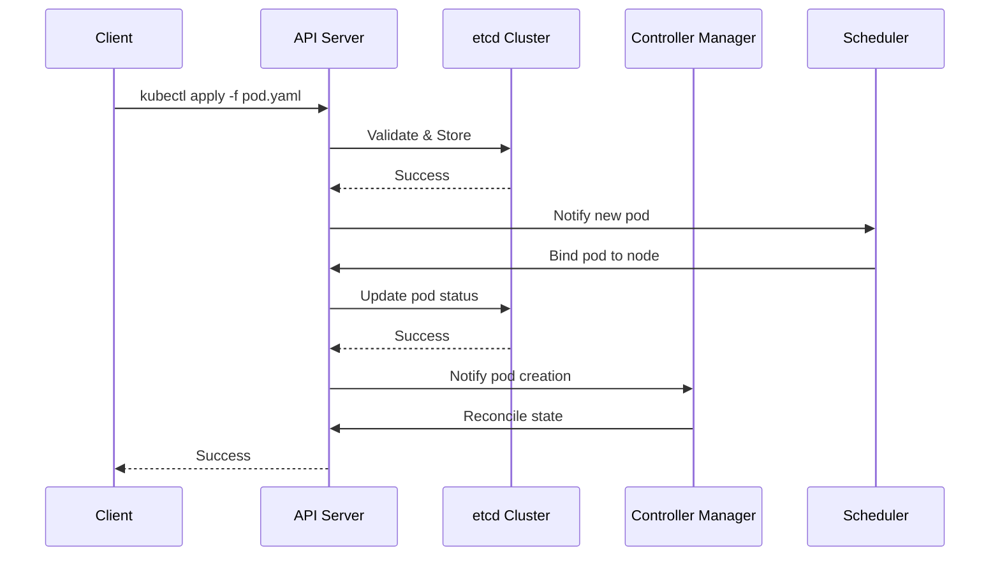

# Module 01: Cluster Architecture Deep-Dive

## Why it matters

Imagine you're the SRE lead at a fintech startup. Your payment processing platform handles $2B in daily transactions. At 2 AM, your monitoring alerts: "etcd cluster unhealthy". Within minutes, API server requests start timing out. Your payment gateway becomes unresponsive. The root cause? A misconfigured etcd backup job filled the disk, triggering leader election chaos. This module will help you prevent such nightmares by understanding the control plane's internals.

## Core concepts

The Kubernetes control plane is a distributed system with three critical components:

1. **API Server**: The cluster's front door. It validates requests, updates etcd, and notifies other components. Think of it as a bouncer at an exclusive club - it checks credentials and maintains the guest list.

2. **etcd**: The cluster's source of truth. It stores all cluster state as key-value pairs. Like a distributed ledger, it uses the Raft consensus algorithm to ensure data consistency across replicas.

3. **Controller Manager & Scheduler**: The brain and traffic cop. The controller manager ensures the actual state matches the desired state, while the scheduler places pods on optimal nodes.

## Hands-on lab

Let's create a highly available control plane using kind:

```bash
# Create a HA cluster with 3 control-plane nodes
cat <<EOF > kind-ha-config.yaml
kind: Cluster
apiVersion: kind.x-k8s.io/v1alpha4
nodes:
- role: control-plane
  extraPortMappings:
  - containerPort: 6443
    hostPort: 6443
- role: control-plane
- role: control-plane
- role: worker
- role: worker
EOF

kind create cluster --config kind-ha-config.yaml --name k8s-ha

# Verify control plane pods
kubectl get pods -n kube-system -l component=kube-apiserver
kubectl get pods -n kube-system -l component=etcd
```

For cloud environments (EKS example):
```bash
eksctl create cluster \
  --name ha-cluster \
  --region us-west-2 \
  --node-type t3.large \
  --nodes 3 \
  --managed \
  --control-plane-subnet-ids subnet-xxx,subnet-yyy,subnet-zzz
```

## Diagrams



## Gotchas & troubleshooting

1. **etcd Performance Issues**
   ```bash
   # Check etcd metrics
   kubectl exec -n kube-system etcd-k8s-ha-control-plane -- etcdctl endpoint health
   
   # Monitor etcd disk usage
   kubectl exec -n kube-system etcd-k8s-ha-control-plane -- df -h /var/lib/etcd
   
   # Debug etcd leader election
   kubectl logs -n kube-system etcd-k8s-ha-control-plane | grep "leader changed"
   ```

2. **API Server Problems**
   ```bash
   # Check API server health
   curl -k https://localhost:6443/healthz
   
   # Monitor API server metrics
   kubectl get --raw /metrics | grep apiserver
   
   # Debug API server logs
   kubectl logs -n kube-system kube-apiserver-k8s-ha-control-plane
   ```

3. **Common Failure Modes**
   - Disk pressure on etcd nodes
   - Network partition between control plane nodes
   - Resource exhaustion on API server
   - Misconfigured leader election timeouts

## Further reading

1. [Kubernetes Control Plane Components](https://kubernetes.io/docs/concepts/overview/components/#control-plane-components)
2. [etcd Documentation](https://etcd.io/docs/v3.5/op-guide/)
3. [Kubernetes High Availability](https://kubernetes.io/docs/setup/production-environment/tools/kubeadm/high-availability/)
4. [KEP-3294: API Server Network Proxy](https://github.com/kubernetes/enhancements/tree/master/keps/sig-api-machinery/3294-api-server-network-proxy)
5. [etcd Performance Tuning](https://etcd.io/docs/v3.5/tuning/) 