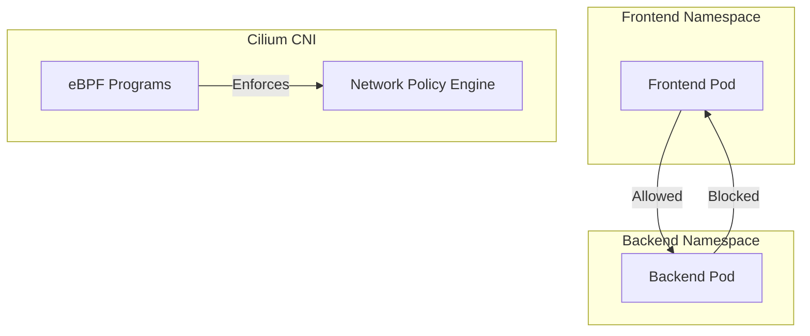

# Module 02: Networking Beyond Services

## Why it matters

A healthcare platform's compliance team discovered a critical security gap: their patient data pods could communicate with billing pods despite being in different namespaces. This violated HIPAA's network segmentation requirements. The team implemented NetworkPolicies, but performance degraded by 40% due to iptables rules. This module explores modern solutions like Cilium's eBPF-powered networking that maintain security without compromising performance.

## Core concepts

Kubernetes networking has evolved beyond basic Services:

1. **Container Network Interface (CNI)**: The plugin architecture that enables different networking solutions. Popular options include:
   - Calico: Battle-tested, policy-driven networking
   - Cilium: eBPF-powered, with service mesh capabilities
   - Flannel: Simple, overlay-based networking

2. **NetworkPolicy**: Kubernetes' built-in firewall that controls pod-to-pod traffic using label selectors. Think of it as a bouncer that checks IDs before allowing communication.

3. **Gateway API**: The next-generation Ingress that brings enterprise-grade features like multi-tenant routing, traffic splitting, and cross-namespace routing.

## Hands-on lab

Let's set up a cluster with Cilium and test advanced networking features:

```bash
# Create a kind cluster with Cilium
cat <<EOF > kind-cilium-config.yaml
kind: Cluster
apiVersion: kind.x-k8s.io/v1alpha4
networking:
  disableDefaultCNI: true  # Disable kind's default CNI
nodes:
- role: control-plane
- role: worker
- role: worker
EOF

kind create cluster --config kind-cilium-config.yaml --name cilium-demo

# Install Cilium with eBPF kube-proxy replacement
helm repo add cilium https://helm.cilium.io/
helm install cilium cilium/cilium \
  --namespace kube-system \
  --set kubeProxyReplacement=strict \
  --set k8sServiceHost=cilium-demo-control-plane \
  --set k8sServicePort=6443

# Deploy a sample app with NetworkPolicy
cat <<EOF > frontend-backend.yaml
apiVersion: apps/v1
kind: Deployment
metadata:
  name: frontend
spec:
  selector:
    matchLabels:
      app: frontend
  template:
    metadata:
      labels:
        app: frontend
    spec:
      containers:
      - name: nginx
        image: nginx:alpine
---
apiVersion: apps/v1
kind: Deployment
metadata:
  name: backend
spec:
  selector:
    matchLabels:
      app: backend
  template:
    metadata:
      labels:
        app: backend
    spec:
      containers:
      - name: nginx
        image: nginx:alpine
---
apiVersion: networking.k8s.io/v1
kind: NetworkPolicy
metadata:
  name: frontend-backend-policy
spec:
  podSelector:
    matchLabels:
      app: backend
  ingress:
  - from:
    - podSelector:
        matchLabels:
          app: frontend
    ports:
    - protocol: TCP
      port: 80
EOF

kubectl apply -f frontend-backend.yaml
```

For cloud environments (EKS with Cilium):
```bash
eksctl create cluster \
  --name cilium-cluster \
  --region us-west-2 \
  --node-type t3.large \
  --nodes 3 \
  --cni cilium
```

## Diagrams



## Gotchas & troubleshooting

1. **NetworkPolicy Debugging**
   ```bash
   # Check if NetworkPolicy is applied
   kubectl describe networkpolicy frontend-backend-policy
   
   # Test connectivity from frontend to backend
   kubectl exec -it deploy/frontend -- wget -O- backend:80
   
   # Debug Cilium policies
   kubectl exec -n kube-system -it cilium-xxx -- cilium policy get
   ```

2. **Performance Issues**
   ```bash
   # Check Cilium status
   kubectl exec -n kube-system -it cilium-xxx -- cilium status
   
   # Monitor eBPF programs
   kubectl exec -n kube-system -it cilium-xxx -- cilium bpf prog list
   
   # View connection tracking
   kubectl exec -n kube-system -it cilium-xxx -- cilium bpf ct list global
   ```

3. **Common Failure Modes**
   - Misconfigured NetworkPolicies blocking legitimate traffic
   - eBPF program failures on kernel version mismatch
   - DNS resolution issues in multi-cluster setups
   - MTU mismatches in overlay networks

## Further reading

1. [Cilium Documentation](https://docs.cilium.io/en/stable/)
2. [Kubernetes Network Policies](https://kubernetes.io/docs/concepts/services-networking/network-policies/)
3. [Gateway API Documentation](https://gateway-api.sigs.k8s.io/)
4. [eBPF and Kubernetes](https://ebpf.io/what-is-ebpf/)
5. [KEP-2595: Service Internal Traffic Policy](https://github.com/kubernetes/enhancements/tree/master/keps/sig-network/2595-service-internal-traffic-policy) 