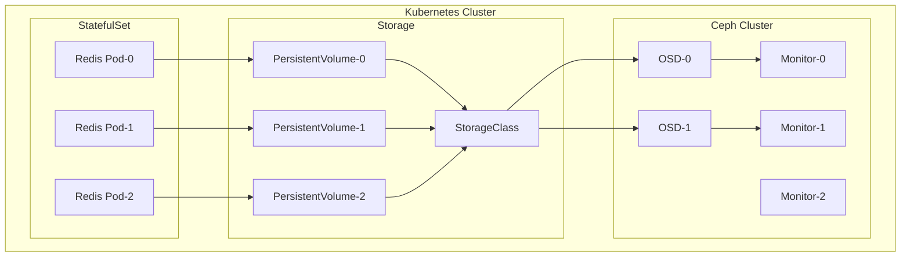

# Module 03: Storage & Stateful Workloads

## Why it matters

A gaming company's multiplayer platform experienced a catastrophic failure when their Redis cluster lost data during a node failure. The root cause? They were using a basic Deployment with hostPath volumes. This module explores how to properly run stateful workloads like databases, message queues, and caches in Kubernetes using StatefulSets, proper storage classes, and data replication.

## Core concepts

Kubernetes storage has evolved to handle complex stateful workloads:

1. **Container Storage Interface (CSI)**: The plugin architecture that enables different storage solutions. Popular options include:
   - AWS EBS CSI Driver
   - Azure Disk CSI Driver
   - Rook-Ceph (self-hosted storage)
   - Longhorn (lightweight distributed storage)

2. **StatefulSets**: Kubernetes' workload API for stateful applications. They provide:
   - Stable network identities
   - Ordered deployment and scaling
   - Ordered automated rolling updates
   - Persistent storage per pod

3. **Storage Classes**: Define different storage tiers and provisioning parameters. They enable:
   - Dynamic provisioning
   - Storage tiering
   - Volume snapshots
   - Volume expansion

## Hands-on lab

Let's deploy a highly available Redis cluster using StatefulSets and Rook-Ceph:

```bash
# Create a kind cluster with extra disks
cat <<EOF > kind-storage-config.yaml
kind: Cluster
apiVersion: kind.x-k8s.io/v1alpha4
nodes:
- role: control-plane
- role: worker
  extraMounts:
  - hostPath: /var/lib/rook
    containerPath: /var/lib/rook
- role: worker
  extraMounts:
  - hostPath: /var/lib/rook
    containerPath: /var/lib/rook
EOF

kind create cluster --config kind-storage-config.yaml --name storage-demo

# Install Rook-Ceph operator
kubectl create -f https://raw.githubusercontent.com/rook/rook/master/deploy/examples/crds.yaml
kubectl create -f https://raw.githubusercontent.com/rook/rook/master/deploy/examples/common.yaml
kubectl create -f https://raw.githubusercontent.com/rook/rook/master/deploy/examples/operator.yaml

# Deploy Ceph cluster
cat <<EOF > ceph-cluster.yaml
apiVersion: ceph.rook.io/v1
kind: CephCluster
metadata:
  name: rook-ceph
  namespace: rook-ceph
spec:
  cephVersion:
    image: quay.io/ceph/ceph:v17.2.6
  dataDirHostPath: /var/lib/rook
  mon:
    count: 3
  dashboard:
    enabled: true
  storage:
    useAllNodes: true
    useAllDevices: true
EOF

kubectl apply -f ceph-cluster.yaml

# Create StorageClass
cat <<EOF > ceph-sc.yaml
apiVersion: storage.k8s.io/v1
kind: StorageClass
metadata:
  name: ceph-block
provisioner: rook-ceph.rbd.csi.ceph.com
parameters:
  clusterID: rook-ceph
  pool: replicapool
  imageFormat: "2"
  imageFeatures: layering
  csi.storage.k8s.io/provisioner-secret-name: rook-csi-rbd-provisioner
  csi.storage.k8s.io/controller-expand-secret-name: rook-csi-rbd-provisioner
  csi.storage.k8s.io/node-stage-secret-name: rook-csi-rbd-node
  csi.storage.k8s.io/fstype: ext4
reclaimPolicy: Retain
allowVolumeExpansion: true
EOF

kubectl apply -f ceph-sc.yaml

# Deploy Redis cluster
cat <<EOF > redis-cluster.yaml
apiVersion: apps/v1
kind: StatefulSet
metadata:
  name: redis
spec:
  serviceName: redis
  replicas: 3
  selector:
    matchLabels:
      app: redis
  template:
    metadata:
      labels:
        app: redis
    spec:
      containers:
      - name: redis
        image: redis:6.2-alpine
        ports:
        - containerPort: 6379
        volumeMounts:
        - name: data
          mountPath: /data
        command:
        - redis-server
        - /redis-config/redis.conf
        volumeMounts:
        - name: config
          mountPath: /redis-config
  volumeClaimTemplates:
  - metadata:
      name: data
    spec:
      accessModes: [ "ReadWriteOnce" ]
      storageClassName: ceph-block
      resources:
        requests:
          storage: 1Gi
---
apiVersion: v1
kind: ConfigMap
metadata:
  name: redis-config
data:
  redis.conf: |
    appendonly yes
    cluster-enabled yes
    cluster-config-file /data/nodes.conf
    cluster-node-timeout 5000
    dir /data
---
apiVersion: v1
kind: Service
metadata:
  name: redis
spec:
  clusterIP: None
  selector:
    app: redis
  ports:
  - port: 6379
    targetPort: 6379
    name: redis
EOF

kubectl apply -f redis-cluster.yaml
```

For cloud environments (EKS with EBS):
```bash
# Create EBS StorageClass
cat <<EOF > ebs-sc.yaml
apiVersion: storage.k8s.io/v1
kind: StorageClass
metadata:
  name: ebs-sc
provisioner: ebs.csi.aws.com
volumeBindingMode: WaitForFirstConsumer
parameters:
  type: io2
  iopsPerGB: "1000"
EOF

kubectl apply -f ebs-sc.yaml
```

## Diagrams



## Gotchas & troubleshooting

1. **Storage Issues**
   ```bash
   # Check PVC status
   kubectl get pvc
   
   # Describe PVC for details
   kubectl describe pvc redis-data-redis-0
   
   # Check Ceph cluster health
   kubectl -n rook-ceph exec -it deploy/rook-ceph-tools -- ceph status
   
   # Monitor Ceph OSDs
   kubectl -n rook-ceph exec -it deploy/rook-ceph-tools -- ceph osd tree
   ```

2. **StatefulSet Problems**
   ```bash
   # Check StatefulSet status
   kubectl get statefulset redis
   
   # View pod events
   kubectl describe pod redis-0
   
   # Check Redis cluster status
   kubectl exec -it redis-0 -- redis-cli cluster info
   
   # Verify data persistence
   kubectl exec -it redis-0 -- redis-cli set test "persistent"
   kubectl delete pod redis-0
   kubectl exec -it redis-0 -- redis-cli get test
   ```

3. **Common Failure Modes**
   - Storage class not found
   - Insufficient storage capacity
   - Node failure during volume attachment
   - Network issues between pods and storage
   - Ceph cluster health issues

## Further reading

1. [Kubernetes StatefulSets](https://kubernetes.io/docs/concepts/workloads/controllers/statefulset/)
2. [Rook-Ceph Documentation](https://rook.io/docs/rook/latest/Getting-Started/intro/)
3. [CSI Driver Documentation](https://kubernetes-csi.github.io/docs/)
4. [KEP-1779: Volume Snapshot](https://github.com/kubernetes/enhancements/tree/master/keps/sig-storage/1779-volume-snapshot)
5. [KEP-1847: Volume Health Monitoring](https://github.com/kubernetes/enhancements/tree/master/keps/sig-storage/1847-volume-health-monitoring) 