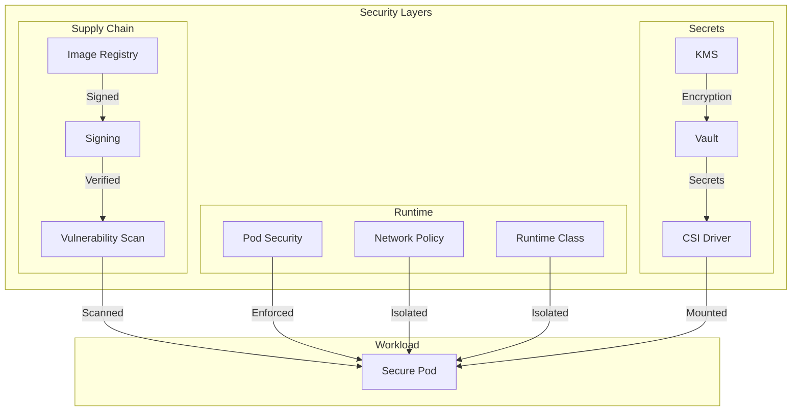

# Module 05: Security Fundamentals 2.0

## Why it matters

A financial services company discovered a critical security breach: an attacker had gained access to their payment processing pods through a compromised container image. The breach exposed customer data and cost millions in remediation. This module explores modern security practices like supply chain security, runtime protection, and zero-trust networking that could have prevented this incident.

## Core concepts

Kubernetes security has evolved beyond basic RBAC:

1. **Supply Chain Security**:
   - Image signing with sigstore/cosign
   - Software Bill of Materials (SBOM)
   - Vulnerability scanning
   - Image provenance

2. **Runtime Security**:
   - Pod Security Standards (PSS)
   - Seccomp profiles
   - AppArmor/SELinux
   - Runtime class isolation

3. **Secret Management**:
   - External secrets operators
   - Vault integration
   - Key rotation
   - Encryption at rest

## Hands-on lab

Let's set up a secure cluster with modern security features:

```bash
# Create a kind cluster with security features
cat <<EOF > kind-security-config.yaml
kind: Cluster
apiVersion: kind.x-k8s.io/v1alpha4
featureGates:
  SeccompDefault: true
  PodSecurity: true
nodes:
- role: control-plane
  kubeadmConfigPatches:
  - |
    kind: ClusterConfiguration
    apiServer:
      extraArgs:
        enable-admission-plugins: "NodeRestriction,PodSecurity"
- role: worker
  kubeadmConfigPatches:
  - |
    kind: JoinConfiguration
    nodeRegistration:
      kubeletExtraArgs:
        seccomp-default: "true"
EOF

kind create cluster --config kind-security-config.yaml --name security-demo

# Install security tools
# 1. Install Kyverno for policy enforcement
helm repo add kyverno https://kyverno.github.io/kyverno/
helm install kyverno kyverno/kyverno \
  --namespace kyverno \
  --create-namespace \
  --set replicaCount=3

# 2. Install Vault for secrets management
helm repo add hashicorp https://helm.releases.hashicorp.com
helm install vault hashicorp/vault \
  --namespace vault \
  --create-namespace \
  --set server.dev.enabled=true \
  --set server.standalone.enabled=true

# 3. Install Trivy operator for vulnerability scanning
helm repo add aquasecurity https://aquasecurity.github.io/helm-charts/
helm install trivy-operator aquasecurity/trivy-operator \
  --namespace trivy-system \
  --create-namespace \
  --set trivy.ignoreUnfixed=true

# Deploy a secure workload
cat <<EOF > secure-workload.yaml
# Kyverno policy for image signing
apiVersion: kyverno.io/v1
kind: ClusterPolicy
metadata:
  name: require-image-signature
spec:
  validationFailureAction: enforce
  rules:
  - name: verify-image-signature
    match:
      any:
      - resources:
          kinds:
          - Pod
    validate:
      message: "Image must be signed by trusted registry"
      pattern:
        spec:
          containers:
          - image: "ghcr.io/your-org/*"
---
# Pod Security Standards
apiVersion: v1
kind: Namespace
metadata:
  name: secure-app
  labels:
    pod-security.kubernetes.io/enforce: restricted
    pod-security.kubernetes.io/audit: restricted
    pod-security.kubernetes.io/warn: restricted
---
# Secure workload
apiVersion: apps/v1
kind: Deployment
metadata:
  name: secure-app
  namespace: secure-app
spec:
  replicas: 3
  selector:
    matchLabels:
      app: secure-app
  template:
    metadata:
      labels:
        app: secure-app
      annotations:
        seccomp.security.alpha.kubernetes.io/pod: runtime/default
        container.apparmor.security.beta.kubernetes.io/secure-app: runtime/default
    spec:
      securityContext:
        runAsNonRoot: true
        runAsUser: 1000
        runAsGroup: 3000
        fsGroup: 2000
      containers:
      - name: secure-app
        image: ghcr.io/your-org/secure-app:latest
        securityContext:
          allowPrivilegeEscalation: false
          capabilities:
            drop:
            - ALL
          readOnlyRootFilesystem: true
        volumeMounts:
        - name: tmp
          mountPath: /tmp
        - name: vault-secrets
          mountPath: /secrets
          readOnly: true
      volumes:
      - name: tmp
        emptyDir: {}
      - name: vault-secrets
        csi:
          driver: secrets-store.csi.k8s.io
          readOnly: true
          volumeAttributes:
            secretProviderClass: vault-secrets
---
# Vault secret provider
apiVersion: secrets-store.csi.x-k8s.io/v1
kind: SecretProviderClass
metadata:
  name: vault-secrets
  namespace: secure-app
spec:
  provider: vault
  parameters:
    vaultAddress: "http://vault.vault:8200"
    objects: |
      - objectName: "database"
        objectPath: "secret/data/database"
        objectType: "secret"
---
# Network policy
apiVersion: networking.k8s.io/v1
kind: NetworkPolicy
metadata:
  name: secure-app-policy
  namespace: secure-app
spec:
  podSelector:
    matchLabels:
      app: secure-app
  policyTypes:
  - Ingress
  - Egress
  ingress:
  - from:
    - namespaceSelector:
        matchLabels:
          name: ingress-nginx
    ports:
    - protocol: TCP
      port: 8080
  egress:
  - to:
    - namespaceSelector:
        matchLabels:
          name: database
    ports:
    - protocol: TCP
      port: 5432
EOF

kubectl apply -f secure-workload.yaml

# Sign and verify container images
# Install cosign
brew install cosign

# Sign your image
cosign sign --key cosign.key ghcr.io/your-org/secure-app:latest

# Verify image signature
cosign verify --key cosign.pub ghcr.io/your-org/secure-app:latest
```

For cloud environments (EKS with security features):
```bash
# Create EKS cluster with security features
eksctl create cluster \
  --name security-demo \
  --region us-west-2 \
  --node-type t3.large \
  --nodes 3 \
  --with-oidc \
  --enable-iam \
  --enable-pod-identity \
  --enable-secrets-store-csi-driver
```

## Diagrams



## Gotchas & troubleshooting

1. **Security Policy Issues**
   ```bash
   # Check Kyverno policy violations
   kubectl get policyreport -A
   
   # View pod security violations
   kubectl get events -n secure-app | grep "violates PodSecurity"
   
   # Check network policy
   kubectl describe networkpolicy secure-app-policy -n secure-app
   ```

2. **Secret Management**
   ```bash
   # Check Vault status
   kubectl exec -n vault vault-0 -- vault status
   
   # Verify secret provider
   kubectl get secretproviderclass -n secure-app
   
   # Check CSI driver
   kubectl get pods -n kube-system -l app=secrets-store-csi-driver
   ```

3. **Common Failure Modes**
   - Image signature verification failures
   - Pod security standard violations
   - Network policy blocking legitimate traffic
   - Secret provider class misconfiguration
   - Vault unseal issues

## Further reading

1. [Kubernetes Security](https://kubernetes.io/docs/concepts/security/)
2. [Kyverno Documentation](https://kyverno.io/docs/)
3. [Vault Kubernetes Integration](https://www.vaultproject.io/docs/platform/k8s)
4. [KEP-2579: Pod Security Standards](https://github.com/kubernetes/enhancements/tree/master/keps/sig-auth/2579-psp-replacement)
5. [KEP-3294: Seccomp Default](https://github.com/kubernetes/enhancements/tree/master/keps/sig-node/3294-seccomp-default) 