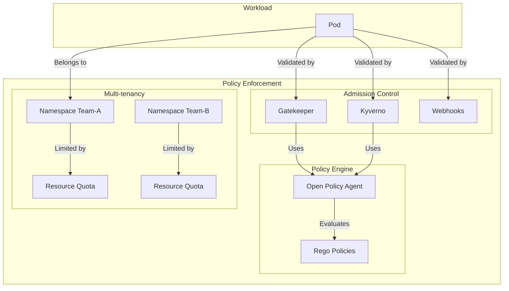

# Module 06: Policy & Governance

## Why it matters

A large enterprise's Kubernetes adoption was stalled by compliance issues: different teams were deploying workloads with inconsistent security settings, resource limits, and network policies. Their audit team couldn't verify compliance across 50+ clusters. This module explores how to implement consistent governance using policy engines, admission controllers, and GitOps practices.

## Core concepts

Kubernetes policy and governance has evolved into a comprehensive framework:

1. **Policy Engines**:
   - OPA/Gatekeeper: Declarative policy enforcement
   - Kyverno: Kubernetes-native policy engine
   - Custom admission webhooks

2. **Multi-tenancy Models**:
   - Soft multi-tenancy (namespaces)
   - Hard multi-tenancy (clusters)
   - Virtual clusters (vcluster)

3. **Compliance & Audit**:
   - Policy as Code
   - Compliance reporting
   - Audit logging
   - Resource quotas

## Hands-on lab

Let's set up a policy-driven cluster with governance features:

```bash
# Create a kind cluster with policy features
cat <<EOF > kind-policy-config.yaml
kind: Cluster
apiVersion: kind.x-k8s.io/v1alpha4
nodes:
- role: control-plane
  kubeadmConfigPatches:
  - |
    kind: ClusterConfiguration
    apiServer:
      extraArgs:
        enable-admission-plugins: "NodeRestriction,ValidatingAdmissionWebhook,MutatingAdmissionWebhook"
- role: worker
EOF

kind create cluster --config kind-policy-config.yaml --name policy-demo

# Install policy tools
# 1. Install Gatekeeper
helm repo add gatekeeper https://open-policy-agent.github.io/gatekeeper/charts
helm install gatekeeper gatekeeper/gatekeeper \
  --namespace gatekeeper-system \
  --create-namespace \
  --set auditInterval=5

# 2. Install Kyverno
helm repo add kyverno https://kyverno.github.io/kyverno/
helm install kyverno kyverno/kyverno \
  --namespace kyverno \
  --create-namespace \
  --set replicaCount=3

# Deploy policy configurations
cat <<EOF > policy-config.yaml
# Gatekeeper template for resource limits
apiVersion: templates.gatekeeper.sh/v1
kind: ConstraintTemplate
metadata:
  name: k8srequiredresources
spec:
  crd:
    spec:
      names:
        kind: K8sRequiredResources
      validation:
        openAPIV3Schema:
          properties:
            limits:
              type: object
              properties:
                cpu:
                  type: string
                memory:
                  type: string
            requests:
              type: object
              properties:
                cpu:
                  type: string
                memory:
                  type: string
  targets:
    - target: admission.k8s.gatekeeper.sh
      rego: |
        package k8srequiredresources
        violation[{"msg": msg}] {
          container := input.review.object.spec.template.spec.containers[_]
          not container.resources.limits
          msg := sprintf("Container %v has no resource limits", [container.name])
        }
        violation[{"msg": msg}] {
          container := input.review.object.spec.template.spec.containers[_]
          not container.resources.requests
          msg := sprintf("Container %v has no resource requests", [container.name])
        }
---
# Gatekeeper constraint
apiVersion: constraints.gatekeeper.sh/v1beta1
kind: K8sRequiredResources
metadata:
  name: require-resource-limits
spec:
  match:
    kinds:
      - apiGroups: ["apps"]
        kinds: ["Deployment", "StatefulSet"]
  parameters:
    limits:
      cpu: "500m"
      memory: "512Mi"
    requests:
      cpu: "100m"
      memory: "128Mi"
---
# Kyverno policy for labels
apiVersion: kyverno.io/v1
kind: ClusterPolicy
metadata:
  name: require-labels
spec:
  validationFailureAction: enforce
  rules:
  - name: check-required-labels
    match:
      any:
      - resources:
          kinds:
          - Pod
          - Deployment
          - StatefulSet
    validate:
      message: "All pods must have app, environment, and team labels"
      pattern:
        metadata:
          labels:
            app: "?*"
            environment: "?*"
            team: "?*"
---
# Kyverno policy for network policy
apiVersion: kyverno.io/v1
kind: ClusterPolicy
metadata:
  name: require-network-policy
spec:
  validationFailureAction: audit
  rules:
  - name: check-network-policy
    match:
      any:
      - resources:
          kinds:
          - Namespace
    validate:
      message: "Each namespace should have a NetworkPolicy"
      pattern:
        metadata:
          name: "?*"
        spec:
          podSelector: {}
          policyTypes:
          - Ingress
          - Egress
---
# Resource quotas
apiVersion: v1
kind: ResourceQuota
metadata:
  name: compute-resources
  namespace: default
spec:
  hard:
    requests.cpu: "4"
    requests.memory: 4Gi
    limits.cpu: "8"
    limits.memory: 8Gi
    pods: "10"
---
# Limit ranges
apiVersion: v1
kind: LimitRange
metadata:
  name: resource-limits
  namespace: default
spec:
  limits:
  - default:
      cpu: 500m
      memory: 512Mi
    defaultRequest:
      cpu: 100m
      memory: 128Mi
    type: Container
---
# Multi-tenant namespace setup
apiVersion: v1
kind: Namespace
metadata:
  name: team-a
  labels:
    team: team-a
    environment: production
---
apiVersion: v1
kind: Namespace
metadata:
  name: team-b
  labels:
    team: team-b
    environment: staging
---
# Team-specific resource quotas
apiVersion: v1
kind: ResourceQuota
metadata:
  name: team-a-quota
  namespace: team-a
spec:
  hard:
    requests.cpu: "2"
    requests.memory: 2Gi
    limits.cpu: "4"
    limits.memory: 4Gi
    pods: "5"
---
apiVersion: v1
kind: ResourceQuota
metadata:
  name: team-b-quota
  namespace: team-b
spec:
  hard:
    requests.cpu: "1"
    requests.memory: 1Gi
    limits.cpu: "2"
    limits.memory: 2Gi
    pods: "3"
EOF

kubectl apply -f policy-config.yaml

# Test policy enforcement
cat <<EOF > test-deployment.yaml
apiVersion: apps/v1
kind: Deployment
metadata:
  name: test-app
  namespace: team-a
  labels:
    app: test-app
    environment: production
    team: team-a
spec:
  replicas: 2
  selector:
    matchLabels:
      app: test-app
  template:
    metadata:
      labels:
        app: test-app
    spec:
      containers:
      - name: nginx
        image: nginx:alpine
        resources:
          requests:
            cpu: "100m"
            memory: "128Mi"
          limits:
            cpu: "200m"
            memory: "256Mi"
EOF

kubectl apply -f test-deployment.yaml
```

For cloud environments (EKS with policy features):
```bash
# Create EKS cluster with policy features
eksctl create cluster \
  --name policy-demo \
  --region us-west-2 \
  --node-type t3.large \
  --nodes 3 \
  --with-oidc \
  --enable-iam \
  --enable-pod-identity
```

## Diagrams



## Gotchas & troubleshooting

1. **Policy Violations**
   ```bash
   # Check Gatekeeper violations
   kubectl get k8srequiredresources.constraints.gatekeeper.sh
   
   # View Kyverno policy reports
   kubectl get policyreport -A
   
   # Check resource quota usage
   kubectl describe resourcequota -A
   ```

2. **Admission Control**
   ```bash
   # Check webhook status
   kubectl get validatingwebhookconfigurations
   kubectl get mutatingwebhookconfigurations
   
   # View admission controller logs
   kubectl logs -n gatekeeper-system -l control-plane=controller-manager
   kubectl logs -n kyverno -l app.kubernetes.io/name=kyverno
   ```

3. **Common Failure Modes**
   - Policy conflicts between Gatekeeper and Kyverno
   - Resource quota exhaustion
   - Webhook timeouts
   - Policy evaluation performance issues
   - Multi-tenant namespace conflicts

## Further reading

1. [OPA/Gatekeeper Documentation](https://open-policy-agent.github.io/gatekeeper/website/docs/)
2. [Kyverno Documentation](https://kyverno.io/docs/)
3. [Kubernetes Multi-tenancy](https://kubernetes.io/docs/concepts/security/multi-tenancy/)
4. [KEP-2579: Pod Security Standards](https://github.com/kubernetes/enhancements/tree/master/keps/sig-auth/2579-psp-replacement)
5. [KEP-3294: Policy as Code](https://github.com/kubernetes/enhancements/tree/master/keps/sig-auth/3294-policy-as-code) 