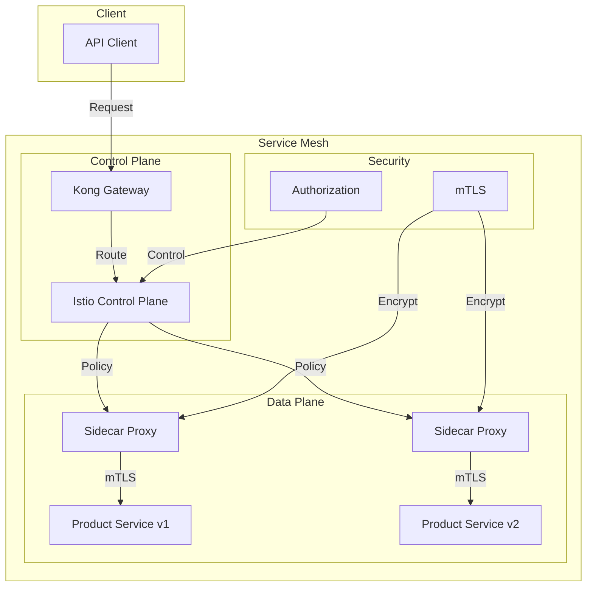

# Module 09: Service Mesh & API Gateway

## Why it matters

An e-commerce platform's microservices architecture became increasingly complex: their 50+ services had inconsistent retry policies, circuit breakers, and observability. During Black Friday, cascading failures occurred due to missing circuit breakers and improper load balancing. This module explores how service meshes like Istio and API gateways like Kong can provide consistent traffic management, security, and observability across services.

## Core concepts

Service mesh and API gateway patterns have become essential for microservices:

1. **Service Mesh**:
   - Traffic management (retries, circuit breakers)
   - Security (mTLS, authorization)
   - Observability (distributed tracing)
   - Load balancing

2. **API Gateway**:
   - Request routing
   - Rate limiting
   - Authentication/Authorization
   - API versioning

3. **Integration Patterns**:
   - Sidecar injection
   - Gateway delegation
   - Multi-cluster mesh
   - Canary deployments

## Hands-on lab

Let's set up a service mesh with API gateway:

```bash
# Create a kind cluster with service mesh support
cat <<EOF > kind-mesh-config.yaml
kind: Cluster
apiVersion: kind.x-k8s.io/v1alpha4
nodes:
- role: control-plane
  extraPortMappings:
  - containerPort: 80
    hostPort: 80
    protocol: TCP  # Kong Gateway
  - containerPort: 443
    hostPort: 443
    protocol: TCP  # Kong Gateway SSL
  - containerPort: 8080
    hostPort: 8080
    protocol: TCP  # Istio Ingress
- role: worker
- role: worker
EOF

kind create cluster --config kind-mesh-config.yaml --name mesh-demo

# Install Istio
istioctl install --set profile=demo -y

# Install Kong Gateway
helm repo add kong https://charts.konghq.com
helm install kong kong/kong \
  --namespace kong \
  --create-namespace \
  --set ingressController.enabled=true \
  --set ingressController.installCRDs=true

# Deploy sample microservices
cat <<EOF > microservices.yaml
# Istio Gateway
apiVersion: networking.istio.io/v1alpha3
kind: Gateway
metadata:
  name: microservices-gateway
spec:
  selector:
    istio: ingressgateway
  servers:
  - port:
      number: 80
      name: http
      protocol: HTTP
    hosts:
    - "*"
---
# Virtual Service
apiVersion: networking.istio.io/v1alpha3
kind: VirtualService
metadata:
  name: product-service
spec:
  hosts:
  - "*"
  gateways:
  - microservices-gateway
  http:
  - match:
    - uri:
        prefix: /api/products
    route:
    - destination:
        host: product-service
        port:
          number: 8080
    retries:
      attempts: 3
      perTryTimeout: 2s
    timeout: 5s
---
# Destination Rule
apiVersion: networking.istio.io/v1alpha3
kind: DestinationRule
metadata:
  name: product-service
spec:
  host: product-service
  trafficPolicy:
    loadBalancer:
      simple: ROUND_ROBIN
    connectionPool:
      tcp:
        maxConnections: 100
      http:
        http1MaxPendingRequests: 1024
        maxRequestsPerConnection: 10
    outlierDetection:
      consecutive5xxErrors: 5
      interval: 30s
      baseEjectionTime: 30s
      maxEjectionPercent: 10
---
# Kong API Gateway
apiVersion: configuration.konghq.com/v1
kind: KongIngress
metadata:
  name: product-service
spec:
  proxy:
    protocol: http
    path: /api/products
    connect_timeout: 5000
    read_timeout: 5000
    write_timeout: 5000
  route:
    protocols:
    - http
    - https
    strip_path: true
    preserve_host: true
---
# Product Service
apiVersion: apps/v1
kind: Deployment
metadata:
  name: product-service
  labels:
    app: product-service
spec:
  replicas: 3
  selector:
    matchLabels:
      app: product-service
  template:
    metadata:
      labels:
        app: product-service
      annotations:
        sidecar.istio.io/inject: "true"
    spec:
      containers:
      - name: product-service
        image: ghcr.io/your-org/product-service:latest
        ports:
        - containerPort: 8080
        env:
        - name: SERVICE_NAME
          value: product-service
        resources:
          requests:
            cpu: "100m"
            memory: "128Mi"
          limits:
            cpu: "200m"
            memory: "256Mi"
        readinessProbe:
          httpGet:
            path: /ready
            port: 8080
          initialDelaySeconds: 5
          periodSeconds: 10
        livenessProbe:
          httpGet:
            path: /health
            port: 8080
          initialDelaySeconds: 15
          periodSeconds: 20
---
# Service
apiVersion: v1
kind: Service
metadata:
  name: product-service
spec:
  selector:
    app: product-service
  ports:
  - port: 8080
    targetPort: 8080
    name: http
---
# Authorization Policy
apiVersion: security.istio.io/v1beta1
kind: AuthorizationPolicy
metadata:
  name: product-service-auth
spec:
  selector:
    matchLabels:
      app: product-service
  rules:
  - from:
    - source:
        principals: ["cluster.local/ns/default/sa/product-service"]
    to:
    - operation:
        methods: ["GET"]
        paths: ["/api/products/*"]
---
# Circuit Breaker
apiVersion: networking.istio.io/v1alpha3
kind: DestinationRule
metadata:
  name: product-service-circuit-breaker
spec:
  host: product-service
  trafficPolicy:
    outlierDetection:
      consecutive5xxErrors: 5
      interval: 30s
      baseEjectionTime: 30s
      maxEjectionPercent: 10
---
# Canary Deployment
apiVersion: apps/v1
kind: Deployment
metadata:
  name: product-service-v2
  labels:
    app: product-service
    version: v2
spec:
  replicas: 1
  selector:
    matchLabels:
      app: product-service
      version: v2
  template:
    metadata:
      labels:
        app: product-service
        version: v2
      annotations:
        sidecar.istio.io/inject: "true"
    spec:
      containers:
      - name: product-service
        image: ghcr.io/your-org/product-service:v2
        ports:
        - containerPort: 8080
---
# Canary Virtual Service
apiVersion: networking.istio.io/v1alpha3
kind: VirtualService
metadata:
  name: product-service-canary
spec:
  hosts:
  - "*"
  gateways:
  - microservices-gateway
  http:
  - match:
    - uri:
        prefix: /api/products
      headers:
        x-canary: "true"
    route:
    - destination:
        host: product-service
        subset: v2
        port:
          number: 8080
    - destination:
        host: product-service
        subset: v1
        port:
          number: 8080
      weight: 90
EOF

kubectl apply -f microservices.yaml

# Enable mTLS
cat <<EOF > mtls.yaml
apiVersion: security.istio.io/v1beta1
kind: PeerAuthentication
metadata:
  name: default
  namespace: istio-system
spec:
  mtls:
    mode: STRICT
---
apiVersion: security.istio.io/v1beta1
kind: DestinationRule
metadata:
  name: default
  namespace: istio-system
spec:
  host: "*.local"
  trafficPolicy:
    tls:
      mode: ISTIO_MUTUAL
EOF

kubectl apply -f mtls.yaml

# Test the service mesh
# Generate traffic
kubectl run -it --rm load-generator --image=curlimages/curl -- sh -c "while true; do curl -H 'x-canary: true' http://product-service:8080/api/products; sleep 1; done"

# View metrics
istioctl dashboard prometheus
istioctl dashboard grafana
istioctl dashboard kiali
```

For cloud environments (EKS with service mesh):
```bash
# Create EKS cluster with service mesh
eksctl create cluster \
  --name mesh-demo \
  --region us-west-2 \
  --node-type t3.large \
  --nodes 3 \
  --with-oidc \
  --enable-iam \
  --enable-pod-identity \
  --enable-istio \
  --enable-kong
```

## Diagrams



## Gotchas & troubleshooting

1. **Service Mesh Issues**
   ```bash
   # Check Istio status
   istioctl verify-install
   istioctl analyze
   
   # View sidecar injection
   kubectl get pods -l app=product-service -o jsonpath='{.items[*].spec.containers[*].name}'
   
   # Check mTLS status
   istioctl authn tls-check product-service
   ```

2. **API Gateway**
   ```bash
   # Check Kong status
   kubectl get pods -n kong
   
   # View Kong routes
   kubectl get kongingress
   
   # Test gateway
   curl -i http://localhost/api/products
   ```

3. **Common Failure Modes**
   - Sidecar injection failures
   - mTLS certificate issues
   - Circuit breaker misconfigurations
   - Gateway routing conflicts
   - Canary deployment traffic splitting

## Further reading

1. [Istio Documentation](https://istio.io/latest/docs/)
2. [Kong Gateway Documentation](https://docs.konghq.com/gateway/)
3. [Service Mesh Interface](https://smi-spec.io/)
4. [KEP-3325: Service Mesh Interface](https://github.com/kubernetes/enhancements/tree/master/keps/sig-network/3325-service-mesh-interface)
5. [KEP-3294: Gateway API](https://github.com/kubernetes/enhancements/tree/master/keps/sig-network/3294-gateway-api) 