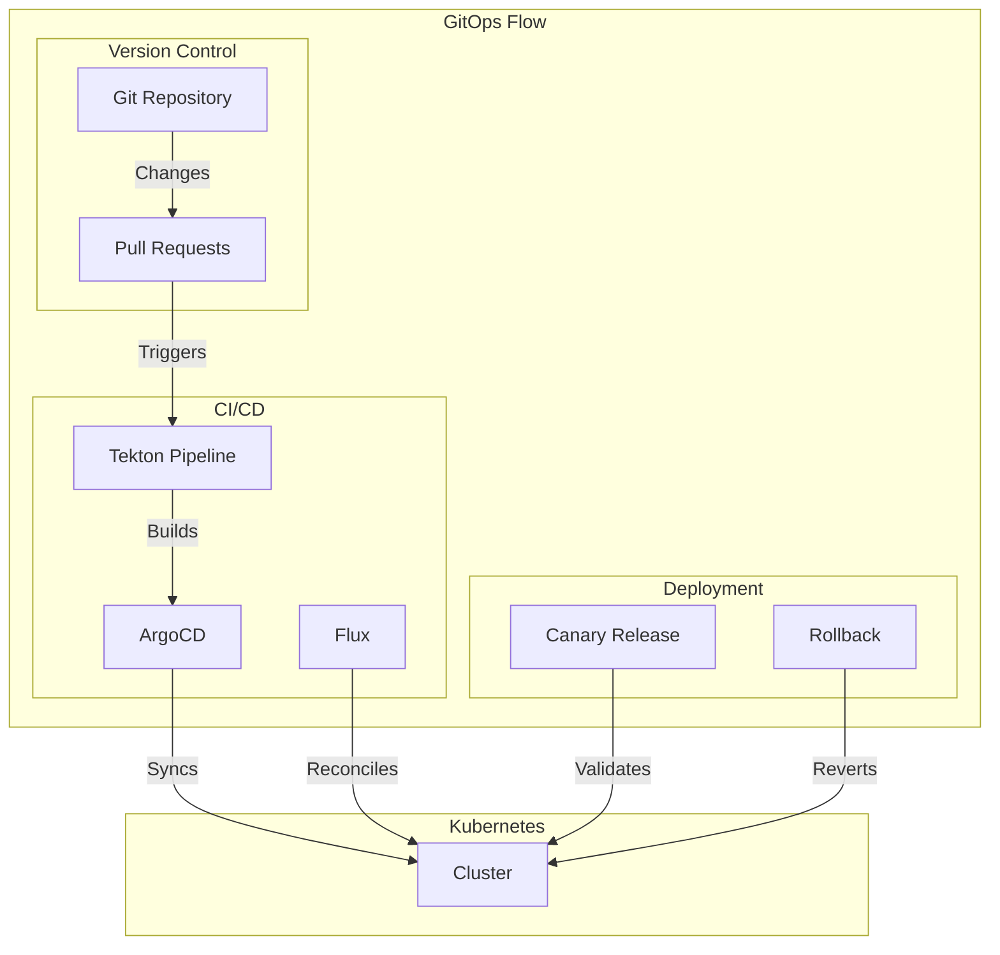

# Module 10: GitOps & Continuous Delivery

## Why it matters

A fintech startup's deployment process was manual and error-prone: developers would SSH into production clusters to apply changes, leading to configuration drift and security incidents. After implementing GitOps with ArgoCD and Flux, they achieved zero-touch deployments, automated rollbacks, and complete audit trails. This module explores modern GitOps practices and continuous delivery patterns.

## Core concepts

GitOps and continuous delivery have revolutionized Kubernetes deployments:

1. **GitOps Principles**:
   - Declarative configuration
   - Version control as source of truth
   - Automated synchronization
   - Drift detection and reconciliation

2. **Continuous Delivery Tools**:
   - ArgoCD/Flux for GitOps
   - Tekton for CI/CD pipelines
   - Helm for package management
   - Kustomize for configuration

3. **Deployment Patterns**:
   - Progressive delivery
   - Automated rollbacks
   - Environment promotion
   - Infrastructure as Code

## Hands-on lab

Let's set up a GitOps-driven cluster:

```bash
# Create a kind cluster with GitOps support
cat <<EOF > kind-gitops-config.yaml
kind: Cluster
apiVersion: kind.x-k8s.io/v1alpha4
nodes:
- role: control-plane
  extraPortMappings:
  - containerPort: 8080
    hostPort: 8080
    protocol: TCP  # ArgoCD
  - containerPort: 9000
    hostPort: 9000
    protocol: TCP  # Tekton Dashboard
- role: worker
- role: worker
EOF

kind create cluster --config kind-gitops-config.yaml --name gitops-demo

# Install ArgoCD
kubectl create namespace argocd
kubectl apply -n argocd -f https://raw.githubusercontent.com/argoproj/argo-cd/stable/manifests/install.yaml

# Install Tekton
kubectl apply -f https://storage.googleapis.com/tekton-releases/pipeline/latest/release.yaml
kubectl apply -f https://storage.googleapis.com/tekton-releases/triggers/latest/release.yaml
kubectl apply -f https://storage.googleapis.com/tekton-releases/dashboard/latest/release.yaml

# Deploy GitOps configuration
cat <<EOF > gitops-config.yaml
# ArgoCD Application
apiVersion: argoproj.io/v1alpha1
kind: Application
metadata:
  name: sample-app
  namespace: argocd
spec:
  project: default
  source:
    repoURL: https://github.com/your-org/gitops-demo.git
    targetRevision: HEAD
    path: apps/sample-app
  destination:
    server: https://kubernetes.default.svc
    namespace: sample-app
  syncPolicy:
    automated:
      prune: true
      selfHeal: true
    syncOptions:
    - CreateNamespace=true
    - PruneLast=true
---
# Tekton Pipeline
apiVersion: tekton.dev/v1beta1
kind: Pipeline
metadata:
  name: sample-app-pipeline
spec:
  workspaces:
  - name: shared-workspace
  params:
  - name: git-url
    type: string
  - name: git-revision
    type: string
    default: "main"
  - name: image-tag
    type: string
  tasks:
  - name: fetch-repository
    taskRef:
      name: git-clone
    workspaces:
    - name: output
      workspace: shared-workspace
    params:
    - name: url
      value: $(params.git-url)
    - name: revision
      value: $(params.git-revision)
  - name: build-image
    runAfter:
    - fetch-repository
    taskRef:
      name: kaniko
    workspaces:
    - name: source
      workspace: shared-workspace
    params:
    - name: IMAGE
      value: ghcr.io/your-org/sample-app:$(params.image-tag)
---
# Tekton Trigger
apiVersion: triggers.tekton.dev/v1alpha1
kind: EventListener
metadata:
  name: github-listener
spec:
  serviceAccountName: tekton-triggers-sa
  triggers:
  - name: github-push-trigger
    interceptors:
    - ref:
        name: "github"
      params:
      - name: "secretRef"
        value:
          secretName: github-secret
          secretKey: secretToken
      - name: "eventTypes"
        value: ["push"]
    bindings:
    - ref: github-push-binding
    template:
      ref: sample-app-pipeline-template
---
# Helm Release
apiVersion: helm.toolkit.fluxcd.io/v2beta1
kind: HelmRelease
metadata:
  name: sample-app
  namespace: sample-app
spec:
  interval: 5m
  chart:
    spec:
      chart: sample-app
      version: "1.0.0"
      sourceRef:
        kind: HelmRepository
        name: sample-app-repo
        namespace: flux-system
  values:
    replicaCount: 3
    image:
      repository: ghcr.io/your-org/sample-app
      tag: latest
    resources:
      requests:
        cpu: 100m
        memory: 128Mi
      limits:
        cpu: 200m
        memory: 256Mi
---
# Kustomization
apiVersion: kustomize.toolkit.fluxcd.io/v1beta2
kind: Kustomization
metadata:
  name: sample-app
  namespace: flux-system
spec:
  interval: 10m
  path: ./apps/sample-app/overlays/production
  prune: true
  sourceRef:
    kind: GitRepository
    name: flux-system
  validation: client
---
# Progressive Delivery
apiVersion: flagger.app/v1beta1
kind: Canary
metadata:
  name: sample-app
  namespace: sample-app
spec:
  targetRef:
    apiVersion: apps/v1
    kind: Deployment
    name: sample-app
  progressDeadlineSeconds: 600
  service:
    port: 80
    targetPort: 8080
  analysis:
    interval: 30s
    threshold: 5
    maxWeight: 50
    stepWeight: 10
    metrics:
    - name: request-success-rate
      thresholdRange:
        min: 99
      interval: 1m
    - name: request-duration
      thresholdRange:
        max: 500
      interval: 1m
    webhooks:
      - name: load-test
        url: http://flagger-loadtester.sample-app/
        timeout: 5s
        metadata:
          cmd: "hey -z 1m -q 10 -c 2 http://sample-app-canary.sample-app:80/"
EOF

kubectl apply -f gitops-config.yaml

# Create Git repository structure
mkdir -p gitops-demo/{apps/sample-app/{base,overlays/{staging,production}},infrastructure}
cd gitops-demo

# Base Kustomization
cat <<EOF > apps/sample-app/base/kustomization.yaml
apiVersion: kustomize.config.k8s.io/v1beta1
kind: Kustomization
resources:
- deployment.yaml
- service.yaml
- hpa.yaml
commonLabels:
  app: sample-app
EOF

# Production Overlay
cat <<EOF > apps/sample-app/overlays/production/kustomization.yaml
apiVersion: kustomize.config.k8s.io/v1beta1
kind: Kustomization
resources:
- ../../base
namespace: production
patches:
- path: replicas.yaml
- path: resources.yaml
EOF

# Infrastructure as Code
cat <<EOF > infrastructure/cluster.yaml
apiVersion: infrastructure.cluster.x-k8s.io/v1beta1
kind: Cluster
metadata:
  name: production
  namespace: default
spec:
  clusterNetwork:
    pods:
      cidrBlocks: ["192.168.0.0/16"]
    services:
      cidrBlocks: ["10.96.0.0/12"]
  controlPlaneRef:
    apiVersion: controlplane.cluster.x-k8s.io/v1beta1
    kind: KubeadmControlPlane
    name: production-control-plane
  infrastructureRef:
    apiVersion: infrastructure.cluster.x-k8s.io/v1beta1
    kind: AWSCluster
    name: production
EOF

# Initialize Git repository
git init
git add .
git commit -m "Initial GitOps configuration"

# Push to GitHub
git remote add origin https://github.com/your-org/gitops-demo.git
git push -u origin main

# Monitor GitOps status
kubectl get applications -n argocd
kubectl get helmreleases -A
kubectl get kustomizations -A
kubectl get canaries -A
```

For cloud environments (EKS with GitOps):
```bash
# Create EKS cluster with GitOps
eksctl create cluster \
  --name gitops-demo \
  --region us-west-2 \
  --node-type t3.large \
  --nodes 3 \
  --with-oidc \
  --enable-iam \
  --enable-pod-identity \
  --enable-argocd \
  --enable-tekton
```

## Diagrams



## Gotchas & troubleshooting

1. **GitOps Issues**
   ```bash
   # Check ArgoCD status
   kubectl get applications -n argocd
   kubectl get application -n argocd sample-app -o yaml
   
   # View sync status
   argocd app get sample-app
   argocd app history sample-app
   
   # Check Flux status
   flux get kustomizations
   flux get helmreleases
   ```

2. **Pipeline Problems**
   ```bash
   # Check Tekton status
   kubectl get pipelineruns
   kubectl get taskruns
   
   # View pipeline logs
   tkn pipelinerun logs
   
   # Check trigger events
   kubectl get eventlisteners
   ```

3. **Common Failure Modes**
   - Git repository access issues
   - ArgoCD sync conflicts
   - Pipeline timeout
   - Canary analysis failures
   - Helm chart version mismatches

## Further reading

1. [ArgoCD Documentation](https://argoproj.github.io/argo-cd/)
2. [Tekton Documentation](https://tekton.dev/docs/)
3. [Flux Documentation](https://fluxcd.io/docs/)
4. [KEP-3325: GitOps Toolkit](https://github.com/kubernetes/enhancements/tree/master/keps/sig-apps/3325-gitops-toolkit)
5. [KEP-3294: Progressive Delivery](https://github.com/kubernetes/enhancements/tree/master/keps/sig-apps/3294-progressive-delivery) 