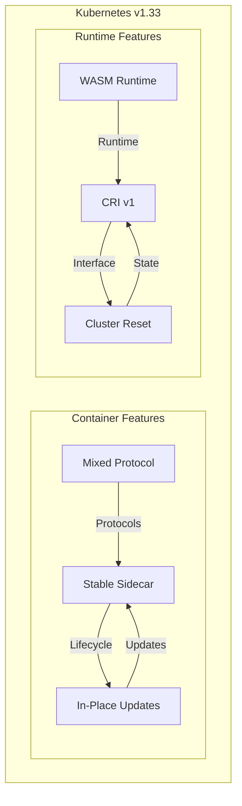

# Module 15: Emerging Features (v1.33)

## Why it matters

A cloud-native startup struggled with sidecar container lifecycle management and mixed-protocol services. Their microservices architecture required complex workarounds for these limitations. With Kubernetes v1.33's stable sidecar containers, mixed-protocol services, and in-place pod updates, they simplified their deployment patterns and improved resource efficiency. This module explores the latest Kubernetes features and their practical applications.

## Core concepts

- **Stable Sidecar Containers**:
  - Lifecycle management
  - Resource guarantees
  - Startup ordering
  - Graceful termination
- **Mixed-Protocol Services**:
  - TCP/UDP coexistence
  - Protocol selection
  - Port management
  - Service discovery
- **In-Place Pod Updates**:
  - Container image updates
  - Resource limit changes
  - Volume mount updates
  - Graceful restarts
- **WASM Runtimes**:
  - WebAssembly support
  - Runtime selection
  - Performance optimization
  - Security isolation
- **CRI v1 & Cluster Reset**:
  - Container runtime interface
  - Cluster state management
  - Reset procedures
  - Recovery options

## Hands-on lab

```bash
# Create a kind cluster with v1.33
kind create cluster --image kindest/node:v1.33.0 --name v133-lab

# Deploy a sidecar-enabled application
cat <<EOF | kubectl apply -f -
apiVersion: apps/v1
kind: Deployment
metadata:
  name: sidecar-demo
spec:
  replicas: 2
  selector:
    matchLabels:
      app: sidecar-demo
  template:
    metadata:
      labels:
        app: sidecar-demo
    spec:
      containers:
      - name: main
        image: nginx:latest
        ports:
        - containerPort: 80
        resources:
          requests:
            cpu: 100m
            memory: 128Mi
      - name: sidecar
        image: fluent/fluent-bit:latest
        lifecycle:
          type: Sidecar
        resources:
          requests:
            cpu: 50m
            memory: 64Mi
        volumeMounts:
        - name: varlog
          mountPath: /var/log
      volumes:
      - name: varlog
        hostPath:
          path: /var/log
---
# Mixed-protocol service
apiVersion: v1
kind: Service
metadata:
  name: mixed-protocol
spec:
  selector:
    app: sidecar-demo
  ports:
  - name: http
    port: 80
    targetPort: 80
    protocol: TCP
  - name: metrics
    port: 9090
    targetPort: 9090
    protocol: UDP
---
# WASM runtime configuration
apiVersion: node.k8s.io/v1
kind: RuntimeClass
metadata:
  name: wasm
handler: wasm
---
# In-place pod update
apiVersion: apps/v1
kind: Deployment
metadata:
  name: inplace-update-demo
spec:
  replicas: 2
  selector:
    matchLabels:
      app: inplace-update-demo
  template:
    metadata:
      labels:
        app: inplace-update-demo
    spec:
      containers:
      - name: app
        image: nginx:1.24
        resources:
          requests:
            cpu: 100m
            memory: 128Mi
        volumeMounts:
        - name: config
          mountPath: /etc/nginx/conf.d
      volumes:
      - name: config
        configMap:
          name: nginx-config
EOF

# Test sidecar lifecycle
kubectl get pods -l app=sidecar-demo
kubectl describe pod -l app=sidecar-demo

# Update pod in-place
kubectl patch deployment inplace-update-demo --patch '
{
  "spec": {
    "template": {
      "spec": {
        "containers": [{
          "name": "app",
          "image": "nginx:1.25",
          "resources": {
            "requests": {
              "cpu": "200m",
              "memory": "256Mi"
            }
          }
        }]
      }
    }
  }
}'

# Deploy WASM workload
cat <<EOF | kubectl apply -f -
apiVersion: apps/v1
kind: Deployment
metadata:
  name: wasm-demo
spec:
  replicas: 2
  selector:
    matchLabels:
      app: wasm-demo
  template:
    metadata:
      labels:
        app: wasm-demo
    spec:
      runtimeClassName: wasm
      containers:
      - name: wasm-app
        image: wasmcloud/wasmcloud:latest
        resources:
          requests:
            cpu: 100m
            memory: 128Mi
EOF

# Test cluster reset API
kubectl cluster-info dump > cluster-state.json
kubectl cluster reset --force

# Cloud note: For EKS/AKS/GKE, check managed cluster version support
```

## Diagrams



## Gotchas & troubleshooting

- **Sidecar Issues**
  ```bash
  # Check sidecar status
  kubectl get pods -l app=sidecar-demo
  kubectl describe pod -l app=sidecar-demo
  
  # Verify sidecar lifecycle
  kubectl logs -l app=sidecar-demo -c sidecar
  
  # Check resource usage
  kubectl top pods -l app=sidecar-demo
  ```

- **WASM Runtime Problems**
  ```bash
  # Check runtime class
  kubectl get runtimeclass
  
  # Verify WASM pod status
  kubectl get pods -l app=wasm-demo
  kubectl describe pod -l app=wasm-demo
  
  # Check runtime logs
  kubectl logs -l app=wasm-demo
  ```

- **Common Failure Modes**
  - Sidecar startup failures
  - Protocol conflicts
  - In-place update rollbacks
  - WASM runtime compatibility
  - Cluster reset failures

## Further reading

1. [Kubernetes v1.33 Release Notes](https://kubernetes.io/docs/setup/release/notes/)
2. [Sidecar Container KEP](https://github.com/kubernetes/enhancements/tree/master/keps/sig-node/753-sidecar-containers)
3. [WASM in Kubernetes](https://github.com/kubernetes/enhancements/tree/master/keps/sig-node/2430-wasm)
4. [CRI v1 Specification](https://github.com/kubernetes/cri-api/blob/master/pkg/apis/runtime/v1/api.proto)
5. [Cluster Reset KEP](https://github.com/kubernetes/enhancements/tree/master/keps/sig-cluster-lifecycle/2815-cluster-reset) 