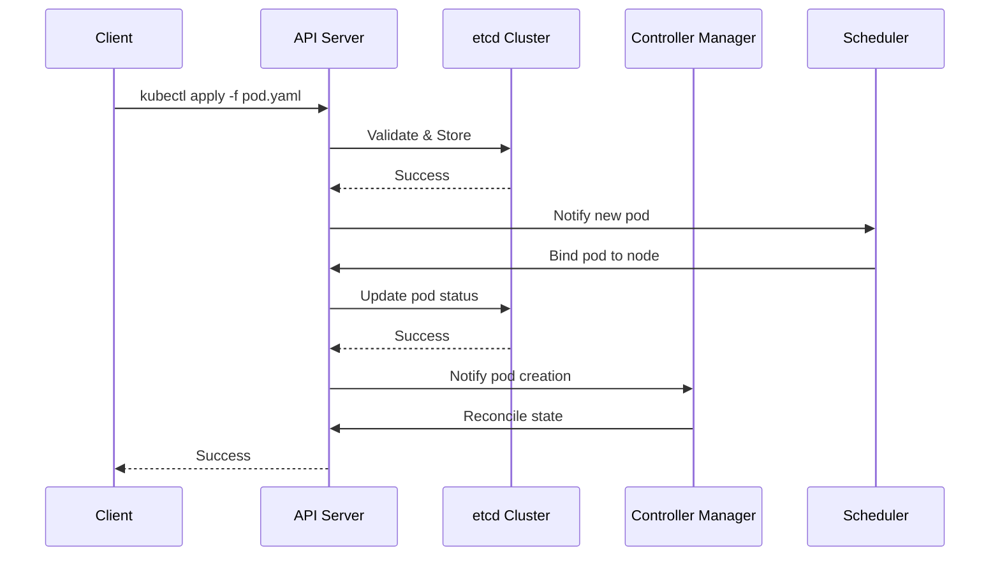

# Module 01: Cluster Architecture Deep-Dive

## Learning Objectives
By the end of this module, you will be able to:
- Understand the fundamental components of the Kubernetes control plane
- Explain the role and responsibilities of each control plane component
- Deploy and manage a highly available Kubernetes cluster
- Troubleshoot common control plane issues
- Implement best practices for control plane security and performance

## Why it matters

Imagine you're the SRE lead at a fintech startup. Your payment processing platform handles $2B in daily transactions. At 2 AM, your monitoring alerts: "etcd cluster unhealthy". Within minutes, API server requests start timing out. Your payment gateway becomes unresponsive. The root cause? A misconfigured etcd backup job filled the disk, triggering leader election chaos. This module will help you prevent such nightmares by understanding the control plane's internals.

## Theoretical Foundation

### 1. Control Plane Architecture Overview

The Kubernetes control plane is a distributed system that maintains the desired state of your cluster. It consists of several components that work together to ensure cluster stability and reliability.

#### 1.1 API Server (kube-apiserver)
- **Purpose**: Acts as the front-end for the Kubernetes control plane
- **Key Responsibilities**:
  - Authentication and Authorization
  - Request validation and admission control
  - REST API endpoint for all cluster operations
  - State persistence through etcd
- **Architecture Details**:
  - Stateless design allows horizontal scaling
  - Implements OpenAPI specification
  - Supports multiple authentication methods (certificates, tokens, webhooks)
  - Implements admission controllers for request validation

#### 1.2 etcd
- **Purpose**: Distributed key-value store that serves as the cluster's source of truth
- **Key Responsibilities**:
  - Storing all cluster configuration data
  - Maintaining cluster state
  - Enabling leader election
- **Architecture Details**:
  - Uses Raft consensus algorithm
  - Implements distributed locking
  - Supports transactions and watch operations
  - Maintains a revision history of all changes

#### 1.3 Controller Manager (kube-controller-manager)
- **Purpose**: Runs controller processes that regulate the state of the cluster
- **Key Controllers**:
  - Node Controller: Monitors node health
  - Replication Controller: Maintains correct number of pods
  - Endpoints Controller: Populates endpoint objects
  - Service Account & Token Controllers: Handle authentication
- **Architecture Details**:
  - Implements the reconciliation loop pattern
  - Uses optimistic concurrency control
  - Supports leader election for high availability

#### 1.4 Scheduler (kube-scheduler)
- **Purpose**: Assigns pods to nodes based on resource requirements and constraints
- **Key Responsibilities**:
  - Resource allocation
  - Pod placement decisions
  - Load balancing
- **Architecture Details**:
  - Implements a pluggable scheduling framework
  - Uses a scoring system for node selection
  - Supports custom scheduling policies

## Hands-on Lab: Building a Production-Ready Control Plane

### Prerequisites
- Docker installed
- kind (Kubernetes in Docker) installed
- kubectl configured
- Basic understanding of Linux networking

### Step 1: Environment Setup
```bash
# Verify prerequisites
docker --version
kind --version
kubectl version --client

# Create a working directory
mkdir -p ~/k8s-lab/control-plane
cd ~/k8s-lab/control-plane
```

### Step 2: Create a Highly Available Cluster
```bash
# Create a HA cluster configuration
cat <<EOF > kind-ha-config.yaml
kind: Cluster
apiVersion: kind.x-k8s.io/v1alpha4
nodes:
- role: control-plane
  extraPortMappings:
  - containerPort: 6443
    hostPort: 6443
    protocol: TCP
  kubeadmConfigPatches:
  - |
    kind: InitConfiguration
    nodeRegistration:
      kubeletExtraArgs:
        node-labels: "ingress-ready=true"
- role: control-plane
  kubeadmConfigPatches:
  - |
    kind: JoinConfiguration
    nodeRegistration:
      kubeletExtraArgs:
        node-labels: "ingress-ready=true"
- role: control-plane
  kubeadmConfigPatches:
  - |
    kind: JoinConfiguration
    nodeRegistration:
      kubeletExtraArgs:
        node-labels: "ingress-ready=true"
- role: worker
- role: worker
EOF

# Create the cluster
kind create cluster --config kind-ha-config.yaml --name k8s-ha

# Verify cluster creation
kubectl cluster-info
kubectl get nodes
```

### Step 3: Verify Control Plane Components
```bash
# Check API Server status
kubectl get pods -n kube-system -l component=kube-apiserver
kubectl logs -n kube-system -l component=kube-apiserver

# Verify etcd cluster health
kubectl get pods -n kube-system -l component=etcd
for pod in $(kubectl get pods -n kube-system -l component=etcd -o jsonpath='{.items[*].metadata.name}'); do
  echo "Checking etcd health for $pod:"
  kubectl exec -n kube-system $pod -- etcdctl endpoint health
done

# Monitor control plane components
kubectl get pods -n kube-system -l tier=control-plane
```

### Step 4: Implement Basic Security Measures
```bash
# Create a service account for monitoring
kubectl create serviceaccount control-plane-monitor -n kube-system

# Create RBAC rules
cat <<EOF | kubectl apply -f -
apiVersion: rbac.authorization.k8s.io/v1
kind: ClusterRole
metadata:
  name: control-plane-monitor
rules:
- apiGroups: [""]
  resources: ["nodes", "pods", "services"]
  verbs: ["get", "list", "watch"]
---
apiVersion: rbac.authorization.k8s.io/v1
kind: ClusterRoleBinding
metadata:
  name: control-plane-monitor
subjects:
- kind: ServiceAccount
  name: control-plane-monitor
  namespace: kube-system
roleRef:
  kind: ClusterRole
  name: control-plane-monitor
  apiGroup: rbac.authorization.k8s.io
EOF
```

## Troubleshooting Guide

### 1. API Server Issues
#### Symptoms:
- kubectl commands timing out
- 503 Service Unavailable errors
- High latency in API responses

#### Diagnostic Steps:
```bash
# Check API server health
curl -k https://localhost:6443/healthz

# Monitor API server metrics
kubectl get --raw /metrics | grep apiserver

# Check API server logs
kubectl logs -n kube-system -l component=kube-apiserver

# Verify API server resource usage
kubectl top pod -n kube-system -l component=kube-apiserver
```

### 2. etcd Issues
#### Symptoms:
- Leader election failures
- High latency in cluster operations
- Data inconsistency

#### Diagnostic Steps:
```bash
# Check etcd cluster health
kubectl exec -n kube-system etcd-k8s-ha-control-plane -- etcdctl endpoint health

# Monitor etcd metrics
kubectl exec -n kube-system etcd-k8s-ha-control-plane -- etcdctl endpoint status

# Check etcd logs
kubectl logs -n kube-system -l component=etcd

# Verify etcd disk usage
kubectl exec -n kube-system etcd-k8s-ha-control-plane -- df -h /var/lib/etcd
```

### 3. Controller Manager Issues
#### Symptoms:
- Pods not being created
- Services not being updated
- Node status not being updated

#### Diagnostic Steps:
```bash
# Check controller manager status
kubectl get pods -n kube-system -l component=kube-controller-manager

# Monitor controller manager logs
kubectl logs -n kube-system -l component=kube-controller-manager

# Verify controller manager metrics
kubectl get --raw /metrics | grep controller_manager
```

## Best Practices

### 1. Control Plane Security
- Implement network policies to restrict access to control plane components
- Use RBAC to limit access to sensitive operations
- Regularly rotate certificates and credentials
- Enable audit logging for security monitoring

### 2. Performance Optimization
- Monitor and tune etcd performance
- Implement proper resource limits for control plane components
- Use appropriate node sizes for control plane nodes
- Regular maintenance and cleanup of old data

### 3. High Availability
- Deploy control plane components across multiple availability zones
- Implement proper backup and restore procedures
- Use load balancers for API server access
- Monitor and maintain etcd cluster health

## Further Reading

1. [Kubernetes Control Plane Components](https://kubernetes.io/docs/concepts/overview/components/#control-plane-components)
2. [etcd Documentation](https://etcd.io/docs/v3.5/op-guide/)
3. [Kubernetes High Availability](https://kubernetes.io/docs/setup/production-environment/tools/kubeadm/high-availability/)
4. [KEP-3294: API Server Network Proxy](https://github.com/kubernetes/enhancements/tree/master/keps/sig-api-machinery/3294-api-server-network-proxy)
5. [etcd Performance Tuning](https://etcd.io/docs/v3.5/tuning/)
6. [Kubernetes Security Best Practices](https://kubernetes.io/docs/concepts/security/)
7. [Control Plane Monitoring](https://kubernetes.io/docs/tasks/debug/debug-cluster/resource-usage-monitoring/)

## Practice Exercises

1. **Basic Level**:
   - Deploy a single-node cluster using kind
   - Verify all control plane components
   - Monitor basic metrics

2. **Intermediate Level**:
   - Deploy a HA cluster with 3 control plane nodes
   - Implement basic security measures
   - Set up monitoring and alerting

3. **Advanced Level**:
   - Implement custom admission controllers
   - Set up etcd backup and restore procedures
   - Configure advanced networking for control plane components

## Assessment Questions

1. What is the role of the API Server in the Kubernetes control plane?
2. How does etcd ensure data consistency in a distributed environment?
3. What are the key responsibilities of the Controller Manager?
4. How does the Scheduler make pod placement decisions?
5. What are the common failure modes in a HA control plane setup?
6. How would you troubleshoot API Server performance issues?
7. What security measures should be implemented for a production control plane?
8. How do you ensure high availability of the control plane components?

## Diagrams



## Gotchas & troubleshooting

1. **etcd Performance Issues**
   ```bash
   # Check etcd metrics
   kubectl exec -n kube-system etcd-k8s-ha-control-plane -- etcdctl endpoint health
   
   # Monitor etcd disk usage
   kubectl exec -n kube-system etcd-k8s-ha-control-plane -- df -h /var/lib/etcd
   
   # Debug etcd leader election
   kubectl logs -n kube-system etcd-k8s-ha-control-plane | grep "leader changed"
   ```

2. **API Server Problems**
   ```bash
   # Check API server health
   curl -k https://localhost:6443/healthz
   
   # Monitor API server metrics
   kubectl get --raw /metrics | grep apiserver
   
   # Debug API server logs
   kubectl logs -n kube-system kube-apiserver-k8s-ha-control-plane
   ```

3. **Common Failure Modes**
   - Disk pressure on etcd nodes
   - Network partition between control plane nodes
   - Resource exhaustion on API server
   - Misconfigured leader election timeouts

## Further reading

1. [Kubernetes Control Plane Components](https://kubernetes.io/docs/concepts/overview/components/#control-plane-components)
2. [etcd Documentation](https://etcd.io/docs/v3.5/op-guide/)
3. [Kubernetes High Availability](https://kubernetes.io/docs/setup/production-environment/tools/kubeadm/high-availability/)
4. [KEP-3294: API Server Network Proxy](https://github.com/kubernetes/enhancements/tree/master/keps/sig-api-machinery/3294-api-server-network-proxy)
5. [etcd Performance Tuning](https://etcd.io/docs/v3.5/tuning/) 