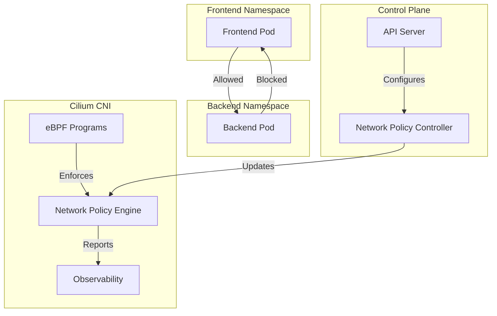

# Module 02: Networking Beyond Services

## Learning Objectives
By the end of this module, you will be able to:
- Understand the evolution of Kubernetes networking beyond basic Services
- Implement and manage different Container Network Interface (CNI) plugins
- Design and implement NetworkPolicies for pod-to-pod communication control
- Deploy and configure modern networking solutions like Cilium
- Troubleshoot common networking issues in Kubernetes clusters
- Implement advanced networking features using Gateway API

## Why it matters

A healthcare platform's compliance team discovered a critical security gap: their patient data pods could communicate with billing pods despite being in different namespaces. This violated HIPAA's network segmentation requirements. The team implemented NetworkPolicies, but performance degraded by 40% due to iptables rules. This module explores modern solutions like Cilium's eBPF-powered networking that maintain security without compromising performance.

## Theoretical Foundation

### 1. Kubernetes Networking Evolution

#### 1.1 Basic Networking Requirements
- **Pod-to-Pod Communication**: Direct communication between pods without NAT
- **Pod-to-Service Communication**: Stable network endpoints for services
- **External-to-Service Communication**: Access to services from outside the cluster
- **Network Policies**: Fine-grained control over pod-to-pod traffic

#### 1.2 Container Network Interface (CNI)
- **Purpose**: Standard interface for container networking
- **Key Components**:
  - CNI Plugin: Implements the CNI specification
  - IPAM (IP Address Management): Handles IP allocation
  - Network Plugin: Manages network connectivity
- **Popular Implementations**:
  - **Calico**:
    - BGP-based routing
    - Network policy enforcement
    - Cross-cluster networking
  - **Cilium**:
    - eBPF-powered networking
    - Service mesh capabilities
    - Advanced security features
  - **Flannel**:
    - Simple overlay networking
    - Multiple backend options
    - Easy to deploy and maintain

#### 1.3 Network Policies
- **Purpose**: Define rules for pod-to-pod communication
- **Key Concepts**:
  - Pod Selectors: Target specific pods using labels
  - Ingress/Egress Rules: Control traffic direction
  - Port/Protocol Rules: Define allowed traffic types
- **Implementation Methods**:
  - iptables-based (traditional)
  - eBPF-based (modern)
  - Cloud provider-specific

#### 1.4 Gateway API
- **Purpose**: Next-generation service networking
- **Key Features**:
  - Multi-tenant routing
  - Traffic splitting
  - Cross-namespace routing
  - Advanced load balancing
- **Components**:
  - GatewayClass: Defines types of gateways
  - Gateway: Instantiates a gateway
  - HTTPRoute: Defines routing rules
  - Service: Backend services

### 2. Modern Networking Solutions

#### 2.1 eBPF in Kubernetes Networking
- **What is eBPF**: Extended Berkeley Packet Filter
- **Benefits**:
  - Kernel-level programmability
  - Improved performance
  - Enhanced observability
  - Better security
- **Use Cases**:
  - Network policy enforcement
  - Load balancing
  - Traffic monitoring
  - Security filtering

#### 2.2 Service Mesh Integration
- **Purpose**: Advanced service-to-service communication
- **Features**:
  - Traffic management
  - Security
  - Observability
- **Popular Solutions**:
  - Istio
  - Linkerd
  - Cilium Service Mesh

## Hands-on Lab: Implementing Advanced Networking

### Prerequisites
- Docker installed
- kind (Kubernetes in Docker) installed
- kubectl configured
- Helm v3 installed
- Basic understanding of networking concepts

### Step 1: Environment Setup
```bash
# Verify prerequisites
docker --version
kind --version
kubectl version --client
helm version

# Create a working directory
mkdir -p ~/k8s-lab/networking
cd ~/k8s-lab/networking
```

### Step 2: Create a Cluster with Cilium CNI
```bash
# Create cluster configuration
cat <<EOF > kind-cilium-config.yaml
kind: Cluster
apiVersion: kind.x-k8s.io/v1alpha4
networking:
  disableDefaultCNI: true  # Disable kind's default CNI
  podSubnet: "10.244.0.0/16"
  serviceSubnet: "10.96.0.0/12"
nodes:
- role: control-plane
  kubeadmConfigPatches:
  - |
    kind: InitConfiguration
    nodeRegistration:
      kubeletExtraArgs:
        node-labels: "ingress-ready=true"
- role: worker
  kubeadmConfigPatches:
  - |
    kind: JoinConfiguration
    nodeRegistration:
      kubeletExtraArgs:
        node-labels: "ingress-ready=true"
- role: worker
  kubeadmConfigPatches:
  - |
    kind: JoinConfiguration
    nodeRegistration:
      kubeletExtraArgs:
        node-labels: "ingress-ready=true"
EOF

# Create the cluster
kind create cluster --config kind-cilium-config.yaml --name cilium-demo

# Verify cluster creation
kubectl cluster-info
kubectl get nodes
```

### Step 3: Install and Configure Cilium
```bash
# Add Cilium Helm repository
helm repo add cilium https://helm.cilium.io/
helm repo update

# Install Cilium with advanced features
helm install cilium cilium/cilium \
  --namespace kube-system \
  --set kubeProxyReplacement=strict \
  --set k8sServiceHost=cilium-demo-control-plane \
  --set k8sServicePort=6443 \
  --set hubble.enabled=true \
  --set hubble.relay.enabled=true \
  --set hubble.ui.enabled=true \
  --set prometheus.enabled=true \
  --set operator.prometheus.enabled=true

# Verify Cilium installation
kubectl -n kube-system get pods -l k8s-app=cilium
kubectl -n kube-system get pods -l k8s-app=hubble-ui
```

### Step 4: Deploy Sample Applications with Network Policies
```bash
# Create namespace for our application
kubectl create namespace app-demo

# Deploy frontend and backend applications
cat <<EOF > app-deployment.yaml
apiVersion: apps/v1
kind: Deployment
metadata:
  name: frontend
  namespace: app-demo
spec:
  replicas: 2
  selector:
    matchLabels:
      app: frontend
  template:
    metadata:
      labels:
        app: frontend
    spec:
      containers:
      - name: nginx
        image: nginx:alpine
        ports:
        - containerPort: 80
---
apiVersion: apps/v1
kind: Deployment
metadata:
  name: backend
  namespace: app-demo
spec:
  replicas: 2
  selector:
    matchLabels:
      app: backend
  template:
    metadata:
      labels:
        app: backend
    spec:
      containers:
      - name: nginx
        image: nginx:alpine
        ports:
        - containerPort: 80
---
apiVersion: v1
kind: Service
metadata:
  name: frontend
  namespace: app-demo
spec:
  selector:
    app: frontend
  ports:
  - port: 80
    targetPort: 80
---
apiVersion: v1
kind: Service
metadata:
  name: backend
  namespace: app-demo
spec:
  selector:
    app: backend
  ports:
  - port: 80
    targetPort: 80
EOF

kubectl apply -f app-deployment.yaml

# Apply Network Policies
cat <<EOF > network-policies.yaml
apiVersion: networking.k8s.io/v1
kind: NetworkPolicy
metadata:
  name: frontend-backend-policy
  namespace: app-demo
spec:
  podSelector:
    matchLabels:
      app: backend
  policyTypes:
  - Ingress
  ingress:
  - from:
    - podSelector:
        matchLabels:
          app: frontend
    ports:
    - protocol: TCP
      port: 80
---
apiVersion: networking.k8s.io/v1
kind: NetworkPolicy
metadata:
  name: deny-all-egress
  namespace: app-demo
spec:
  podSelector: {}
  policyTypes:
  - Egress
  egress:
  - to:
    - namespaceSelector:
        matchLabels:
          kubernetes.io/metadata.name: kube-system
    ports:
    - protocol: UDP
      port: 53
    - protocol: TCP
      port: 443
EOF

kubectl apply -f network-policies.yaml
```

### Step 5: Test and Verify Network Policies
```bash
# Test connectivity from frontend to backend
kubectl exec -n app-demo deploy/frontend -- wget -O- backend:80

# Test connectivity from backend to frontend (should fail)
kubectl exec -n app-demo deploy/backend -- wget -O- frontend:80

# Verify Network Policies
kubectl get networkpolicies -n app-demo
kubectl describe networkpolicy frontend-backend-policy -n app-demo

# Check Cilium policies
kubectl exec -n kube-system -l k8s-app=cilium -- cilium policy get
```

## Troubleshooting Guide

### 1. Network Policy Issues
#### Symptoms:
- Pods cannot communicate despite correct NetworkPolicy
- Unexpected traffic allowed/blocked
- Policy application delays

#### Diagnostic Steps:
```bash
# Check NetworkPolicy status
kubectl get networkpolicies --all-namespaces
kubectl describe networkpolicy <policy-name> -n <namespace>

# Verify pod labels
kubectl get pods --show-labels -n <namespace>

# Test connectivity
kubectl exec -it <pod-name> -n <namespace> -- wget -O- <target-service>:<port>

# Check Cilium policy enforcement
kubectl exec -n kube-system -l k8s-app=cilium -- cilium policy get
kubectl exec -n kube-system -l k8s-app=cilium -- cilium policy trace
```

### 2. CNI Plugin Issues
#### Symptoms:
- Pod networking not working
- CNI plugin pods in CrashLoopBackOff
- Network policy enforcement failures

#### Diagnostic Steps:
```bash
# Check CNI plugin status
kubectl get pods -n kube-system -l k8s-app=cilium
kubectl logs -n kube-system -l k8s-app=cilium

# Verify CNI configuration
kubectl exec -n kube-system -l k8s-app=cilium -- cilium status
kubectl exec -n kube-system -l k8s-app=cilium -- cilium config

# Check node networking
kubectl debug node/<node-name> -it --image=cilium/cilium
```

### 3. Performance Issues
#### Symptoms:
- High latency in pod-to-pod communication
- Network policy enforcement delays
- High CPU usage by CNI components

#### Diagnostic Steps:
```bash
# Monitor Cilium performance
kubectl exec -n kube-system -l k8s-app=cilium -- cilium metrics list

# Check eBPF programs
kubectl exec -n kube-system -l k8s-app=cilium -- cilium bpf prog list

# Analyze connection tracking
kubectl exec -n kube-system -l k8s-app=cilium -- cilium bpf ct list global
```

## Best Practices

### 1. Network Policy Design
- Start with deny-all policies
- Use namespace selectors for cross-namespace policies
- Implement policies incrementally
- Document policy purposes and requirements
- Regular policy audits and reviews

### 2. CNI Selection and Configuration
- Choose CNI based on requirements:
  - Performance: Cilium with eBPF
  - Simplicity: Flannel
  - Enterprise features: Calico
- Proper resource allocation for CNI components
- Regular updates and maintenance
- Monitoring and alerting setup

### 3. Security Considerations
- Implement network segmentation
- Use service mesh for advanced security
- Regular security audits
- Monitor for policy violations
- Implement proper logging and tracing

## Practice Exercises

1. **Basic Level**:
   - Deploy a simple application with basic NetworkPolicies
   - Test pod-to-pod communication
   - Monitor network traffic using Cilium Hubble

2. **Intermediate Level**:
   - Implement multi-tier application with NetworkPolicies
   - Configure cross-namespace communication
   - Set up network monitoring and alerting

3. **Advanced Level**:
   - Implement service mesh with Cilium
   - Configure advanced traffic management
   - Set up multi-cluster networking

## Assessment Questions

1. What are the key differences between traditional and eBPF-based networking in Kubernetes?
2. How do NetworkPolicies work with different CNI plugins?
3. What are the advantages of using Gateway API over traditional Ingress?
4. How does Cilium's eBPF implementation improve network performance?
5. What are the best practices for implementing network segmentation in Kubernetes?
6. How would you troubleshoot pod-to-pod communication issues?
7. What security considerations are important when implementing NetworkPolicies?
8. How do you ensure high availability in a multi-cluster networking setup?

## Further Reading

1. [Cilium Documentation](https://docs.cilium.io/en/stable/)
2. [Kubernetes Network Policies](https://kubernetes.io/docs/concepts/services-networking/network-policies/)
3. [Gateway API Documentation](https://gateway-api.sigs.k8s.io/)
4. [eBPF and Kubernetes](https://ebpf.io/what-is-ebpf/)
5. [KEP-2595: Service Internal Traffic Policy](https://github.com/kubernetes/enhancements/tree/master/keps/sig-network/2595-service-internal-traffic-policy)
6. [Cilium Service Mesh](https://docs.cilium.io/en/stable/gettingstarted/servicemesh/)
7. [Kubernetes Networking Deep Dive](https://kubernetes.io/docs/concepts/cluster-administration/networking/)
8. [Network Policy Best Practices](https://kubernetes.io/docs/concepts/services-networking/network-policies/#best-practices)

## Diagrams

