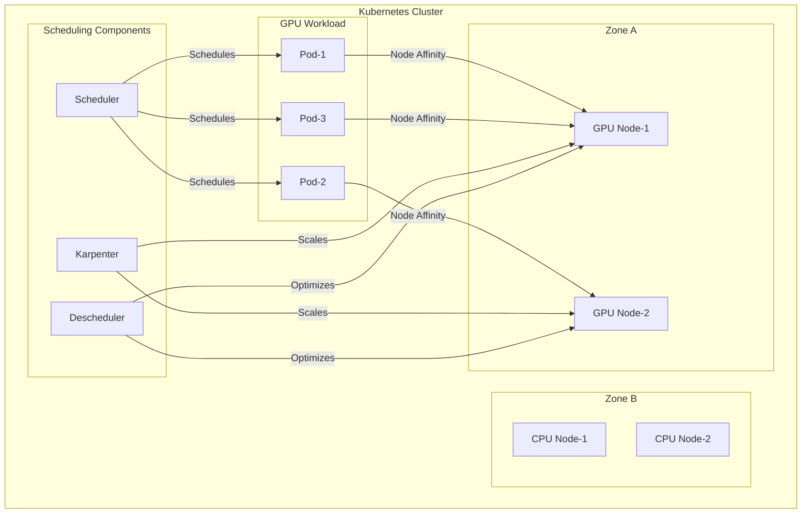

# Module 04: Advanced Scheduling

## Why it matters

A machine learning platform's GPU workloads were experiencing 30% lower throughput than expected. The root cause? Pods were being scheduled across NUMA nodes, causing expensive cross-node memory access. By implementing proper node affinity and topology spread constraints, they achieved optimal GPU utilization and reduced training time by 40%. This module explores how to leverage Kubernetes' advanced scheduling features for optimal workload placement.

## Core concepts

Kubernetes scheduling has evolved beyond basic node selection:

1. **Node Affinity & Anti-affinity**: Fine-grained control over pod placement:
   - Required vs preferred rules
   - Hard vs soft constraints
   - Inter-pod affinity for co-location

2. **Topology Spread Constraints**: Control pod distribution across failure domains:
   - Spread across zones/regions
   - Balance across nodes
   - Respect pod topology

3. **Custom Schedulers**: Extend scheduling logic for specialized workloads:
   - GPU-aware scheduling
   - Batch job scheduling
   - Cost-aware scheduling

## Hands-on lab

Let's set up a cluster with advanced scheduling features:

```bash
# Create a kind cluster with labels
cat <<EOF > kind-scheduling-config.yaml
kind: Cluster
apiVersion: kind.x-k8s.io/v1alpha4
nodes:
- role: control-plane
  labels:
    node-role.kubernetes.io/control-plane: "true"
    topology.kubernetes.io/zone: zone-a
- role: worker
  labels:
    node-role.kubernetes.io/worker: "true"
    topology.kubernetes.io/zone: zone-a
    hardware-type: gpu
- role: worker
  labels:
    node-role.kubernetes.io/worker: "true"
    topology.kubernetes.io/zone: zone-b
    hardware-type: cpu
EOF

kind create cluster --config kind-scheduling-config.yaml --name scheduling-demo

# Deploy a workload with advanced scheduling
cat <<EOF > advanced-scheduling.yaml
apiVersion: apps/v1
kind: Deployment
metadata:
  name: gpu-workload
spec:
  replicas: 3
  selector:
    matchLabels:
      app: gpu-workload
  template:
    metadata:
      labels:
        app: gpu-workload
    spec:
      # Node affinity for GPU nodes
      affinity:
        nodeAffinity:
          requiredDuringSchedulingIgnoredDuringExecution:
            nodeSelectorTerms:
            - matchExpressions:
              - key: hardware-type
                operator: In
                values:
                - gpu
        # Pod anti-affinity for high availability
        podAntiAffinity:
          preferredDuringSchedulingIgnoredDuringExecution:
          - weight: 100
            podAffinityTerm:
              labelSelector:
                matchExpressions:
                - key: app
                  operator: In
                  values:
                  - gpu-workload
              topologyKey: kubernetes.io/hostname
      # Topology spread constraints
      topologySpreadConstraints:
      - maxSkew: 1
        topologyKey: topology.kubernetes.io/zone
        whenUnsatisfiable: DoNotSchedule
        labelSelector:
          matchLabels:
            app: gpu-workload
      containers:
      - name: nginx
        image: nginx:alpine
        resources:
          requests:
            memory: "64Mi"
            cpu: "250m"
          limits:
            memory: "128Mi"
            cpu: "500m"
---
# Deploy Karpenter for auto-scaling
apiVersion: karpenter.sh/v1alpha5
kind: Provisioner
metadata:
  name: default
spec:
  requirements:
    - key: karpenter.sh/capacity-type
      operator: In
      values: ["on-demand"]
    - key: node.kubernetes.io/instance-type
      operator: In
      values: ["t3.large", "t3.xlarge"]
  limits:
    resources:
      cpu: "10"
      memory: 20Gi
  consolidation:
    enabled: true
---
# Deploy descheduler for optimization
apiVersion: "descheduler/v1alpha1"
kind: "DeschedulerPolicy"
metadata:
  name: "descheduler-policy"
spec:
  evictLocalStoragePods: true
  evictSystemCriticalPods: false
  strategies:
    RemovePodsViolatingInterPodAntiAffinity:
      enabled: true
    LowNodeUtilization:
      enabled: true
      params:
        nodeResourceUtilizationThresholds:
          thresholds:
            cpu: 20
            memory: 20
            pods: 20
          targetThresholds:
            cpu: 50
            memory: 50
            pods: 50
EOF

kubectl apply -f advanced-scheduling.yaml

# Install Karpenter
helm repo add karpenter https://charts.karpenter.sh
helm install karpenter karpenter/karpenter \
  --namespace karpenter \
  --create-namespace \
  --set serviceAccount.create=true \
  --set controller.clusterName=scheduling-demo \
  --set controller.clusterEndpoint=$(kubectl config view --minify -o jsonpath='{.clusters[0].cluster.server}') \
  --set aws.defaultInstanceProfile=KarpenterNodeInstanceProfile

# Install descheduler
helm repo add descheduler https://kubernetes-sigs.github.io/descheduler/
helm install descheduler descheduler/descheduler \
  --namespace kube-system \
  --set deschedulerPolicy.evictLocalStoragePods=true \
  --set deschedulerPolicy.evictSystemCriticalPods=false
```

For cloud environments (EKS with GPU nodes):
```bash
# Create GPU node group
eksctl create nodegroup \
  --cluster scheduling-demo \
  --name gpu-nodes \
  --node-type g4dn.xlarge \
  --nodes 2 \
  --nodes-min 1 \
  --nodes-max 3 \
  --region us-west-2 \
  --managed \
  --labels hardware-type=gpu
```

## Diagrams



## Gotchas & troubleshooting

1. **Scheduling Issues**
   ```bash
   # Check pod scheduling status
   kubectl get pods -o wide
   
   # View pod events
   kubectl describe pod gpu-workload-xxx
   
   # Check node capacity
   kubectl describe nodes | grep -A 5 "Allocated resources"
   
   # Verify node labels
   kubectl get nodes --show-labels
   ```

2. **Karpenter Debugging**
   ```bash
   # Check Karpenter logs
   kubectl logs -n karpenter -l app.kubernetes.io/name=karpenter
   
   # View provisioner status
   kubectl get provisioners
   
   # Check node provisioning
   kubectl get nodes -l karpenter.sh/provisioner-name=default
   ```

3. **Common Failure Modes**
   - Insufficient cluster resources
   - Conflicting affinity rules
   - Topology spread constraints too strict
   - Karpenter scaling delays
   - Descheduler eviction loops

## Further reading

1. [Kubernetes Scheduling](https://kubernetes.io/docs/concepts/scheduling-eviction/)
2. [Karpenter Documentation](https://karpenter.sh/docs/)
3. [Descheduler Documentation](https://github.com/kubernetes-sigs/descheduler)
4. [KEP-3094: Pod Scheduling Readiness](https://github.com/kubernetes/enhancements/tree/master/keps/sig-scheduling/3094-pod-scheduling-readiness)
5. [KEP-3521: Pod Topology Spread Constraints](https://github.com/kubernetes/enhancements/tree/master/keps/sig-scheduling/3521-pod-topology-spread-constraints) 