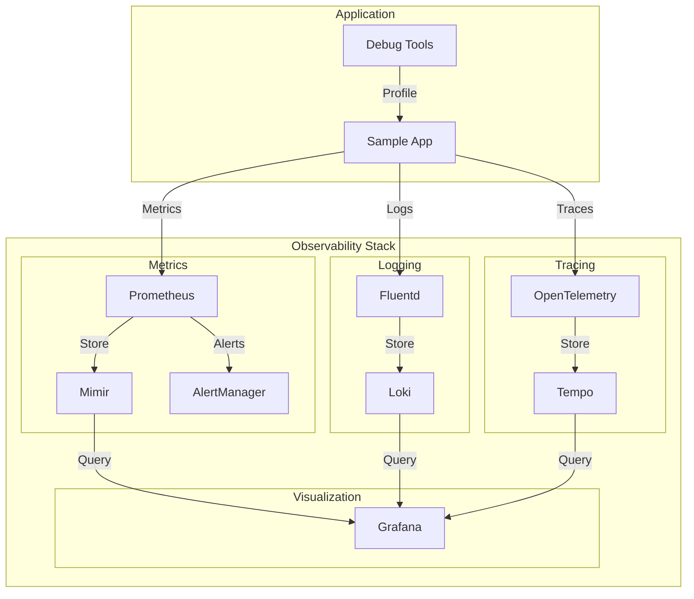

# Module 07: Observability & Debugging

## Why it matters

A microservices platform experienced a cascading failure: a single pod's memory leak triggered node pressure, causing the kubelet to evict pods. The monitoring system missed the early warning signs because it was only collecting basic metrics. This module explores modern observability practices using the LGTM stack (Loki, Grafana, Tempo, Mimir) and advanced debugging tools like eBPF and ephemeral containers.

## Core concepts

Kubernetes observability has evolved beyond basic metrics:

1. **Metrics & Monitoring**:
   - Prometheus Operator
   - Custom metrics adapters
   - Service-level objectives (SLOs)
   - Resource utilization tracking

2. **Logging & Tracing**:
   - Loki for log aggregation
   - OpenTelemetry for tracing
   - Distributed tracing with Tempo
   - Log correlation

3. **Debugging Tools**:
   - Ephemeral containers
   - kubectl debug
   - eBPF profiling
   - Core dumps

## Hands-on lab

Let's set up a comprehensive observability stack:

```bash
# Create a kind cluster with monitoring features
cat <<EOF > kind-monitoring-config.yaml
kind: Cluster
apiVersion: kind.x-k8s.io/v1alpha4
nodes:
- role: control-plane
  extraPortMappings:
  - containerPort: 30000
    hostPort: 30000
    protocol: TCP  # Grafana
  - containerPort: 30001
    hostPort: 30001
    protocol: TCP  # Prometheus
  - containerPort: 30002
    hostPort: 30002
    protocol: TCP  # Loki
- role: worker
- role: worker
EOF

kind create cluster --config kind-monitoring-config.yaml --name monitoring-demo

# Install monitoring stack
# 1. Install Prometheus Operator
helm repo add prometheus-community https://prometheus-community.github.io/helm-charts
helm install prometheus prometheus-community/kube-prometheus-stack \
  --namespace monitoring \
  --create-namespace \
  --set grafana.service.type=NodePort \
  --set grafana.service.nodePort=30000 \
  --set prometheus.service.type=NodePort \
  --set prometheus.service.nodePort=30001

# 2. Install Loki
helm repo add grafana https://grafana.github.io/helm-charts
helm install loki grafana/loki \
  --namespace monitoring \
  --set service.type=NodePort \
  --set service.nodePort=30002

# 3. Install Tempo
helm install tempo grafana/tempo \
  --namespace monitoring \
  --set service.type=ClusterIP

# 4. Install OpenTelemetry Collector
helm repo add open-telemetry https://open-telemetry.github.io/opentelemetry-helm-charts
helm install otel-collector open-telemetry/opentelemetry-collector \
  --namespace monitoring \
  --set mode=daemonset

# Deploy a sample application with instrumentation
cat <<EOF > sample-app.yaml
apiVersion: apps/v1
kind: Deployment
metadata:
  name: sample-app
  namespace: default
spec:
  replicas: 3
  selector:
    matchLabels:
      app: sample-app
  template:
    metadata:
      labels:
        app: sample-app
      annotations:
        prometheus.io/scrape: "true"
        prometheus.io/port: "8080"
        prometheus.io/path: "/metrics"
    spec:
      containers:
      - name: app
        image: ghcr.io/your-org/sample-app:latest
        ports:
        - containerPort: 8080
        env:
        - name: OTEL_EXPORTER_OTLP_ENDPOINT
          value: "http://otel-collector.monitoring:4317"
        - name: OTEL_SERVICE_NAME
          value: "sample-app"
        resources:
          requests:
            cpu: "100m"
            memory: "128Mi"
          limits:
            cpu: "200m"
            memory: "256Mi"
        readinessProbe:
          httpGet:
            path: /ready
            port: 8080
          initialDelaySeconds: 5
          periodSeconds: 10
        livenessProbe:
          httpGet:
            path: /health
            port: 8080
          initialDelaySeconds: 15
          periodSeconds: 20
---
# Service for the application
apiVersion: v1
kind: Service
metadata:
  name: sample-app
spec:
  selector:
    app: sample-app
  ports:
  - port: 80
    targetPort: 8080
---
# ServiceMonitor for Prometheus
apiVersion: monitoring.coreos.com/v1
kind: ServiceMonitor
metadata:
  name: sample-app
  namespace: monitoring
spec:
  selector:
    matchLabels:
      app: sample-app
  endpoints:
  - port: http
    interval: 15s
    path: /metrics
---
# PrometheusRule for alerts
apiVersion: monitoring.coreos.com/v1
kind: PrometheusRule
metadata:
  name: sample-app-alerts
  namespace: monitoring
spec:
  groups:
  - name: sample-app
    rules:
    - alert: HighErrorRate
      expr: rate(http_requests_total{status=~"5.."}[5m]) / rate(http_requests_total[5m]) > 0.1
      for: 5m
      labels:
        severity: warning
      annotations:
        summary: High error rate detected
        description: Error rate is above 10% for the last 5 minutes
    - alert: HighLatency
      expr: histogram_quantile(0.95, rate(http_request_duration_seconds_bucket[5m])) > 1
      for: 5m
      labels:
        severity: warning
      annotations:
        summary: High latency detected
        description: 95th percentile latency is above 1 second
---
# Grafana dashboard
apiVersion: v1
kind: ConfigMap
metadata:
  name: sample-app-dashboard
  namespace: monitoring
data:
  dashboard.json: |
    {
      "annotations": {
        "list": []
      },
      "editable": true,
      "fiscalYearStartMonth": 0,
      "graphTooltip": 0,
      "links": [],
      "liveNow": false,
      "panels": [
        {
          "datasource": {
            "type": "prometheus",
            "uid": "prometheus"
          },
          "fieldConfig": {
            "defaults": {
              "color": {
                "mode": "palette-classic"
              },
              "custom": {
                "axisCenteredZero": false,
                "axisColorMode": "text",
                "axisLabel": "",
                "axisPlacement": "auto",
                "barAlignment": 0,
                "drawStyle": "line",
                "fillOpacity": 10,
                "gradientMode": "none",
                "hideFrom": {
                  "legend": false,
                  "tooltip": false,
                  "viz": false
                },
                "lineInterpolation": "linear",
                "lineWidth": 1,
                "pointSize": 5,
                "scaleDistribution": {
                  "type": "linear"
                },
                "showPoints": "never",
                "spanNulls": false,
                "stacking": {
                  "group": "A",
                  "mode": "none"
                },
                "thresholdsStyle": {
                  "mode": "off"
                }
              },
              "mappings": [],
              "thresholds": {
                "mode": "absolute",
                "steps": [
                  {
                    "color": "green",
                    "value": null
                  }
                ]
              },
              "unit": "short"
            },
            "overrides": []
          },
          "gridPos": {
            "h": 8,
            "w": 12,
            "x": 0,
            "y": 0
          },
          "id": 1,
          "options": {
            "legend": {
              "calcs": [],
              "displayMode": "list",
              "placement": "bottom",
              "showLegend": true
            },
            "tooltip": {
              "mode": "single",
              "sort": "none"
            }
          },
          "targets": [
            {
              "datasource": {
                "type": "prometheus",
                "uid": "prometheus"
              },
              "expr": "rate(http_requests_total[5m])",
              "refId": "A"
            }
          ],
          "title": "Request Rate",
          "type": "timeseries"
        }
      ],
      "refresh": "5s",
      "schemaVersion": 38,
      "style": "dark",
      "tags": [],
      "templating": {
        "list": []
      },
      "time": {
        "from": "now-6h",
        "to": "now"
      },
      "timepicker": {},
      "timezone": "",
      "title": "Sample App Dashboard",
      "uid": "sample-app",
      "version": 1,
      "weekStart": ""
    }
EOF

kubectl apply -f sample-app.yaml

# Debug a problematic pod
kubectl debug -it sample-app-xxx --image=busybox --target=sample-app

# Profile a pod using eBPF
kubectl exec -it sample-app-xxx -- curl -s localhost:8080/debug/pprof/profile > profile.pb.gz
go tool pprof -http=:8081 profile.pb.gz
```

For cloud environments (EKS with monitoring):
```bash
# Create EKS cluster with monitoring
eksctl create cluster \
  --name monitoring-demo \
  --region us-west-2 \
  --node-type t3.large \
  --nodes 3 \
  --with-oidc \
  --enable-iam \
  --enable-pod-identity \
  --enable-cloudwatch-agent
```

## Diagrams



## Gotchas & troubleshooting

1. **Monitoring Issues**
   ```bash
   # Check Prometheus targets
   kubectl port-forward -n monitoring svc/prometheus-operated 9090:9090
   # Visit http://localhost:9090/targets
   
   # View Loki logs
   kubectl port-forward -n monitoring svc/loki 3100:3100
   # Visit http://localhost:3100
   
   # Check Tempo traces
   kubectl port-forward -n monitoring svc/tempo 3200:3200
   # Visit http://localhost:3200
   ```

2. **Debugging Tools**
   ```bash
   # Check pod logs
   kubectl logs -f sample-app-xxx
   
   # Debug container
   kubectl debug -it sample-app-xxx --image=busybox --target=sample-app
   
   # Profile container
   kubectl exec -it sample-app-xxx -- curl -s localhost:8080/debug/pprof/heap > heap.pb.gz
   go tool pprof -http=:8081 heap.pb.gz
   ```

3. **Common Failure Modes**
   - Prometheus storage pressure
   - Log aggregation delays
   - Trace sampling issues
   - Debug container image pull failures
   - eBPF program compatibility

## Further reading

1. [Prometheus Operator Documentation](https://github.com/prometheus-operator/prometheus-operator)
2. [Loki Documentation](https://grafana.com/docs/loki/latest/)
3. [OpenTelemetry Documentation](https://opentelemetry.io/docs/)
4. [KEP-2775: Ephemeral Containers](https://github.com/kubernetes/enhancements/tree/master/keps/sig-node/2775-ephemeral-containers)
5. [KEP-3094: Pod Scheduling Readiness](https://github.com/kubernetes/enhancements/tree/master/keps/sig-scheduling/3094-pod-scheduling-readiness) 