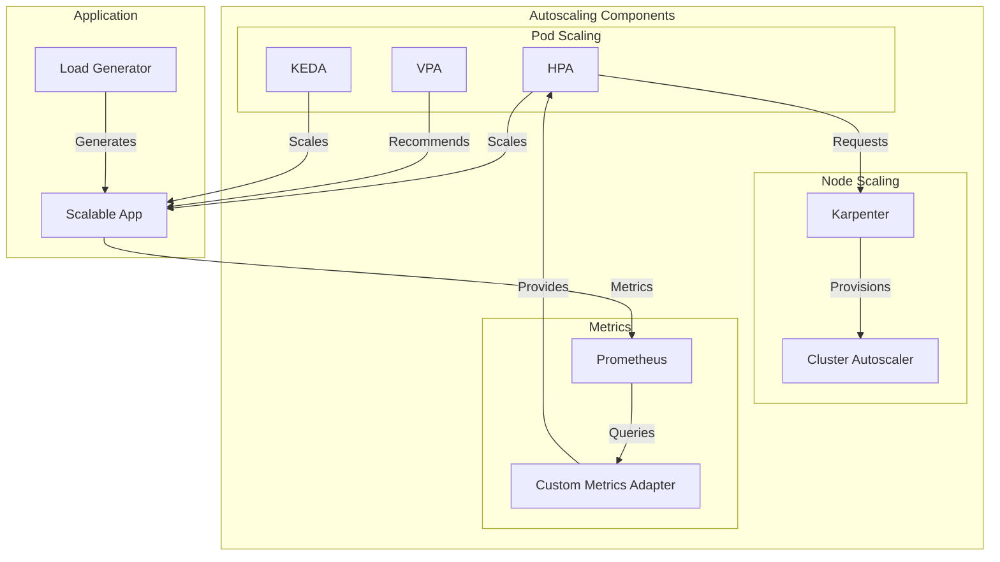

# Module 08: Autoscaling Revisited

## Why it matters

A video streaming platform's autoscaling system failed during a major sports event: their HPA was too slow to react to sudden traffic spikes, and the VPA couldn't handle the rapid memory growth of their video processing pods. This module explores modern autoscaling solutions like KEDA for event-driven scaling, Karpenter for node provisioning, and custom metrics adapters for precise scaling decisions.

## Core concepts

Kubernetes autoscaling has evolved beyond basic HPA:

1. **Horizontal Pod Autoscaling (HPA)**:
   - Custom metrics
   - External metrics
   - Behavior configuration
   - Scaling policies

2. **Vertical Pod Autoscaling (VPA)**:
   - Resource recommendations
   - Auto mode
   - Update mode
   - Admission controller

3. **Node Autoscaling**:
   - Cluster Autoscaler
   - Karpenter
   - Spot instance integration
   - Node pool management

## Hands-on lab

Let's set up a comprehensive autoscaling system:

```bash
# Create a kind cluster with autoscaling features
cat <<EOF > kind-autoscaling-config.yaml
kind: Cluster
apiVersion: kind.x-k8s.io/v1alpha4
nodes:
- role: control-plane
  kubeadmConfigPatches:
  - |
    kind: ClusterConfiguration
    apiServer:
      extraArgs:
        enable-admission-plugins: "NodeRestriction,ValidatingAdmissionWebhook,MutatingAdmissionWebhook"
- role: worker
  labels:
    node-role.kubernetes.io/worker: "true"
    topology.kubernetes.io/zone: zone-a
EOF

kind create cluster --config kind-autoscaling-config.yaml --name autoscaling-demo

# Install autoscaling components
# 1. Install KEDA for event-driven autoscaling
helm repo add kedacore https://kedacore.github.io/charts
helm install keda kedacore/keda \
  --namespace keda \
  --create-namespace \
  --set podSecurityContext.runAsNonRoot=true

# 2. Install VPA
helm repo add fairwinds-stable https://charts.fairwinds.com/stable
helm install vpa fairwinds-stable/vpa \
  --namespace vpa \
  --create-namespace \
  --set recommender.enabled=true \
  --set updater.enabled=true \
  --set admissionController.enabled=true

# 3. Install Karpenter
helm repo add karpenter https://charts.karpenter.sh
helm install karpenter karpenter/karpenter \
  --namespace karpenter \
  --create-namespace \
  --set serviceAccount.create=true \
  --set controller.clusterName=autoscaling-demo \
  --set controller.clusterEndpoint=$(kubectl config view --minify -o jsonpath='{.clusters[0].cluster.server}')

# Deploy a scalable application
cat <<EOF > scalable-app.yaml
# Karpenter provisioner
apiVersion: karpenter.sh/v1alpha5
kind: Provisioner
metadata:
  name: default
spec:
  requirements:
    - key: karpenter.sh/capacity-type
      operator: In
      values: ["on-demand"]
    - key: node.kubernetes.io/instance-type
      operator: In
      values: ["t3.large", "t3.xlarge"]
  limits:
    resources:
      cpu: "10"
      memory: 20Gi
  consolidation:
    enabled: true
---
# VPA configuration
apiVersion: autoscaling.k8s.io/v1
kind: VerticalPodAutoscaler
metadata:
  name: scalable-app-vpa
spec:
  targetRef:
    apiVersion: "apps/v1"
    kind: Deployment
    name: scalable-app
  updatePolicy:
    updateMode: "Auto"
---
# HPA with custom metrics
apiVersion: autoscaling/v2
kind: HorizontalPodAutoscaler
metadata:
  name: scalable-app-hpa
spec:
  scaleTargetRef:
    apiVersion: apps/v1
    kind: Deployment
    name: scalable-app
  minReplicas: 2
  maxReplicas: 10
  metrics:
  - type: Resource
    resource:
      name: cpu
      target:
        type: Utilization
        averageUtilization: 70
  - type: Resource
    resource:
      name: memory
      target:
        type: Utilization
        averageUtilization: 80
  - type: Pods
    pods:
      metric:
        name: http_requests_per_second
      target:
        type: AverageValue
        averageValue: 100
  behavior:
    scaleUp:
      stabilizationWindowSeconds: 60
      policies:
      - type: Percent
        value: 100
        periodSeconds: 60
    scaleDown:
      stabilizationWindowSeconds: 300
      policies:
      - type: Percent
        value: 10
        periodSeconds: 60
---
# KEDA ScaledObject for event-driven scaling
apiVersion: keda.sh/v1alpha1
kind: ScaledObject
metadata:
  name: scalable-app-keda
spec:
  scaleTargetRef:
    name: scalable-app
  minReplicaCount: 2
  maxReplicaCount: 10
  triggers:
  - type: prometheus
    metadata:
      serverAddress: http://prometheus-server.monitoring
      metricName: http_requests_total
      query: rate(http_requests_total{app="scalable-app"}[2m])
      threshold: '100'
---
# Sample application
apiVersion: apps/v1
kind: Deployment
metadata:
  name: scalable-app
spec:
  replicas: 2
  selector:
    matchLabels:
      app: scalable-app
  template:
    metadata:
      labels:
        app: scalable-app
      annotations:
        prometheus.io/scrape: "true"
        prometheus.io/port: "8080"
        prometheus.io/path: "/metrics"
    spec:
      containers:
      - name: app
        image: ghcr.io/your-org/scalable-app:latest
        ports:
        - containerPort: 8080
        resources:
          requests:
            cpu: "100m"
            memory: "128Mi"
          limits:
            cpu: "500m"
            memory: "512Mi"
        readinessProbe:
          httpGet:
            path: /ready
            port: 8080
          initialDelaySeconds: 5
          periodSeconds: 10
        livenessProbe:
          httpGet:
            path: /health
            port: 8080
          initialDelaySeconds: 15
          periodSeconds: 20
---
# Service for the application
apiVersion: v1
kind: Service
metadata:
  name: scalable-app
spec:
  selector:
    app: scalable-app
  ports:
  - port: 80
    targetPort: 8080
---
# Custom metrics adapter
apiVersion: apps/v1
kind: Deployment
metadata:
  name: custom-metrics-adapter
  namespace: kube-system
spec:
  replicas: 1
  selector:
    matchLabels:
      app: custom-metrics-adapter
  template:
    metadata:
      labels:
        app: custom-metrics-adapter
    spec:
      serviceAccountName: custom-metrics-adapter
      containers:
      - name: adapter
        image: ghcr.io/your-org/custom-metrics-adapter:latest
        args:
        - --secure-port=6443
        - --cert-dir=/tmp/certs
        - --logtostderr=true
        - --v=10
        ports:
        - containerPort: 6443
        volumeMounts:
        - name: certs
          mountPath: /tmp/certs
      volumes:
      - name: certs
        emptyDir: {}
---
# Service for custom metrics adapter
apiVersion: v1
kind: Service
metadata:
  name: custom-metrics-adapter
  namespace: kube-system
spec:
  selector:
    app: custom-metrics-adapter
  ports:
  - port: 443
    targetPort: 6443
---
# APIService for custom metrics
apiVersion: apiregistration.k8s.io/v1
kind: APIService
metadata:
  name: v1beta1.custom.metrics.k8s.io
spec:
  service:
    name: custom-metrics-adapter
    namespace: kube-system
  group: custom.metrics.k8s.io
  version: v1beta1
  insecureSkipTLSVerify: true
  groupPriorityMinimum: 100
  versionPriority: 100
EOF

kubectl apply -f scalable-app.yaml

# Generate load for testing
kubectl run -it --rm load-generator --image=busybox -- sh -c "while true; do wget -qO- http://scalable-app; sleep 0.1; done"
```

For cloud environments (EKS with autoscaling):
```bash
# Create EKS cluster with autoscaling
eksctl create cluster \
  --name autoscaling-demo \
  --region us-west-2 \
  --node-type t3.large \
  --nodes 3 \
  --with-oidc \
  --enable-iam \
  --enable-pod-identity \
  --enable-karpenter \
  --enable-spot-instances
```

## Diagrams



## Gotchas & troubleshooting

1. **Autoscaling Issues**
   ```bash
   # Check HPA status
   kubectl get hpa scalable-app-hpa
   kubectl describe hpa scalable-app-hpa
   
   # View VPA recommendations
   kubectl get vpa scalable-app-vpa
   kubectl describe vpa scalable-app-vpa
   
   # Check KEDA scaling
   kubectl get scaledobject scalable-app-keda
   kubectl describe scaledobject scalable-app-keda
   ```

2. **Node Provisioning**
   ```bash
   # Check Karpenter status
   kubectl get provisioners
   kubectl describe provisioner default
   
   # View node provisioning
   kubectl get nodes -l karpenter.sh/provisioner-name=default
   
   # Check node utilization
   kubectl top nodes
   ```

3. **Common Failure Modes**
   - HPA unable to fetch metrics
   - VPA admission controller conflicts
   - Karpenter provisioning delays
   - Custom metrics adapter failures
   - Resource quota exhaustion

## Further reading

1. [Kubernetes Autoscaling](https://kubernetes.io/docs/tasks/run-application/horizontal-pod-autoscale/)
2. [KEDA Documentation](https://keda.sh/docs/)
3. [Karpenter Documentation](https://karpenter.sh/docs/)
4. [KEP-1610: Custom Metrics API](https://github.com/kubernetes/enhancements/tree/master/keps/sig-instrumentation/1610-custom-metrics-api)
5. [KEP-2574: HPA Behavior](https://github.com/kubernetes/enhancements/tree/master/keps/sig-autoscaling/2574-hpa-behavior) 