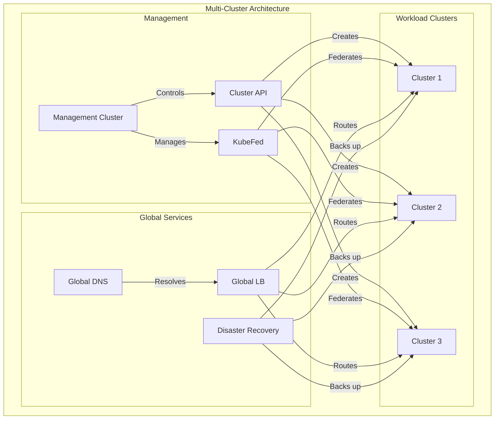

# Module 11: Multi-Cluster Management

## Why it matters

A global SaaS company struggled with managing 20+ Kubernetes clusters across regions: manual updates led to version drift, inconsistent security policies, and operational overhead. By implementing a multi-cluster management strategy with Cluster API and KubeFed, they achieved centralized control, automated updates, and consistent governance. This module explores modern approaches to multi-cluster Kubernetes management.

## Core concepts

Multi-cluster management has become essential for global deployments:

1. **Cluster Management**:
   - Cluster API for lifecycle
   - KubeFed for federation
   - Cluster operators
   - GitOps for clusters

2. **Deployment Patterns**:
   - Global load balancing
   - Multi-cluster ingress
   - Cross-cluster service discovery
   - Disaster recovery

3. **Operational Models**:
   - Hub and spoke
   - Peer-to-peer
   - Regional clusters
   - Edge clusters

## Hands-on lab

Let's set up a multi-cluster environment:

```bash
# Create management cluster
cat <<EOF > kind-management-config.yaml
kind: Cluster
apiVersion: kind.x-k8s.io/v1alpha4
nodes:
- role: control-plane
  extraPortMappings:
  - containerPort: 6443
    hostPort: 6443
    protocol: TCP  # Management API
- role: worker
- role: worker
EOF

kind create cluster --config kind-management-config.yaml --name management-cluster

# Install Cluster API
clusterctl init --infrastructure=aws,docker

# Create workload clusters
cat <<EOF > cluster-template.yaml
apiVersion: cluster.x-k8s.io/v1beta1
kind: Cluster
metadata:
  name: workload-cluster-1
  namespace: default
spec:
  clusterNetwork:
    pods:
      cidrBlocks: ["192.168.0.0/16"]
    services:
      cidrBlocks: ["10.96.0.0/12"]
  controlPlaneRef:
    apiVersion: controlplane.cluster.x-k8s.io/v1beta1
    kind: KubeadmControlPlane
    name: workload-cluster-1-control-plane
  infrastructureRef:
    apiVersion: infrastructure.cluster.x-k8s.io/v1beta1
    kind: DockerCluster
    name: workload-cluster-1
---
apiVersion: controlplane.cluster.x-k8s.io/v1beta1
kind: KubeadmControlPlane
metadata:
  name: workload-cluster-1-control-plane
spec:
  replicas: 1
  version: v1.27.0
  infrastructureTemplate:
    apiVersion: infrastructure.cluster.x-k8s.io/v1beta1
    kind: DockerMachineTemplate
    name: workload-cluster-1-control-plane
  kubeadmConfigSpec:
    clusterConfiguration:
      apiServer:
        extraArgs:
          cloud-provider: external
    initConfiguration:
      nodeRegistration:
        kubeletExtraArgs:
          cloud-provider: external
    joinConfiguration:
      nodeRegistration:
        kubeletExtraArgs:
          cloud-provider: external
---
apiVersion: infrastructure.cluster.x-k8s.io/v1beta1
kind: DockerMachineTemplate
metadata:
  name: workload-cluster-1-control-plane
spec:
  template:
    spec: {}
---
apiVersion: infrastructure.cluster.x-k8s.io/v1beta1
kind: DockerMachineTemplate
metadata:
  name: workload-cluster-1-md-0
spec:
  template:
    spec: {}
---
apiVersion: cluster.x-k8s.io/v1beta1
kind: MachineDeployment
metadata:
  name: workload-cluster-1-md-0
spec:
  clusterName: workload-cluster-1
  replicas: 2
  selector:
    matchLabels: {}
  template:
    spec:
      clusterName: workload-cluster-1
      version: v1.27.0
      infrastructureRef:
        apiVersion: infrastructure.cluster.x-k8s.io/v1beta1
        kind: DockerMachineTemplate
        name: workload-cluster-1-md-0
      bootstrap:
        configRef:
          apiVersion: bootstrap.cluster.x-k8s.io/v1beta1
          kind: KubeadmConfigTemplate
          name: workload-cluster-1-md-0
---
apiVersion: bootstrap.cluster.x-k8s.io/v1beta1
kind: KubeadmConfigTemplate
metadata:
  name: workload-cluster-1-md-0
spec:
  template:
    spec:
      joinConfiguration:
        nodeRegistration:
          kubeletExtraArgs:
            cloud-provider: external
EOF

# Create multiple workload clusters
for i in {1..3}; do
  sed "s/workload-cluster-1/workload-cluster-$i/g" cluster-template.yaml | kubectl apply -f -
done

# Install KubeFed
kubefedctl init \
  --host-cluster-context=kind-management-cluster \
  --dns-provider=coredns \
  --dns-zone-name=example.com \
  --image=ghcr.io/kubernetes-sigs/kubefed/kubefedctl:latest

# Join clusters to federation
for i in {1..3}; do
  kubefedctl join workload-cluster-$i \
    --cluster-context=kind-workload-cluster-$i \
    --host-cluster-context=kind-management-cluster \
    --v=2
done

# Deploy multi-cluster application
cat <<EOF > multi-cluster-app.yaml
# Federated Namespace
apiVersion: types.kubefed.io/v1beta1
kind: FederatedNamespace
metadata:
  name: multi-cluster-app
  namespace: kube-federation-system
spec:
  placement:
    clusters:
    - name: workload-cluster-1
    - name: workload-cluster-2
    - name: workload-cluster-3
---
# Federated Deployment
apiVersion: types.kubefed.io/v1beta1
kind: FederatedDeployment
metadata:
  name: sample-app
  namespace: multi-cluster-app
spec:
  template:
    spec:
      replicas: 3
      selector:
        matchLabels:
          app: sample-app
      template:
        metadata:
          labels:
            app: sample-app
        spec:
          containers:
          - name: nginx
            image: nginx:latest
            ports:
            - containerPort: 80
            resources:
              requests:
                cpu: 100m
                memory: 128Mi
              limits:
                cpu: 200m
                memory: 256Mi
  placement:
    clusters:
    - name: workload-cluster-1
    - name: workload-cluster-2
    - name: workload-cluster-3
  overrides:
  - clusterName: workload-cluster-1
    clusterOverrides:
    - path: "/spec/replicas"
      value: 5
    - path: "/spec/template/spec/containers/0/resources/limits/cpu"
      value: "300m"
---
# Federated Service
apiVersion: types.kubefed.io/v1beta1
kind: FederatedService
metadata:
  name: sample-app
  namespace: multi-cluster-app
spec:
  template:
    spec:
      selector:
        app: sample-app
      ports:
      - port: 80
        targetPort: 80
      type: ClusterIP
  placement:
    clusters:
    - name: workload-cluster-1
    - name: workload-cluster-2
    - name: workload-cluster-3
---
# Federated Ingress
apiVersion: types.kubefed.io/v1beta1
kind: FederatedIngress
metadata:
  name: sample-app
  namespace: multi-cluster-app
spec:
  template:
    spec:
      rules:
      - host: sample-app.example.com
        http:
          paths:
          - path: /
            pathType: Prefix
            backend:
              service:
                name: sample-app
                port:
                  number: 80
  placement:
    clusters:
    - name: workload-cluster-1
    - name: workload-cluster-2
    - name: workload-cluster-3
---
# Multi-Cluster Service
apiVersion: multicluster.x-k8s.io/v1alpha1
kind: ServiceExport
metadata:
  name: sample-app
  namespace: multi-cluster-app
---
apiVersion: multicluster.x-k8s.io/v1alpha1
kind: ServiceImport
metadata:
  name: sample-app
  namespace: multi-cluster-app
spec:
  type: ClusterSetIP
  ports:
  - port: 80
    protocol: TCP
EOF

kubectl apply -f multi-cluster-app.yaml

# Configure global load balancing
cat <<EOF > global-lb.yaml
apiVersion: networking.k8s.io/v1
kind: Ingress
metadata:
  name: global-lb
  namespace: multi-cluster-app
  annotations:
    kubernetes.io/ingress.class: "nginx"
    nginx.ingress.kubernetes.io/upstream-hash-by: "ip_hash"
spec:
  rules:
  - host: global.example.com
    http:
      paths:
      - path: /
        pathType: Prefix
        backend:
          service:
            name: sample-app
            port:
              number: 80
EOF

kubectl apply -f global-lb.yaml

# Monitor multi-cluster status
kubectl get clusters
kubectl get federateddeployments -A
kubectl get federatedservices -A
kubectl get serviceexports -A
kubectl get serviceimports -A
```

For cloud environments (EKS with multi-cluster):
```bash
# Create management cluster
eksctl create cluster \
  --name management-cluster \
  --region us-west-2 \
  --node-type t3.large \
  --nodes 3 \
  --with-oidc \
  --enable-iam \
  --enable-pod-identity

# Create workload clusters
for region in us-west-2 us-east-1 eu-west-1; do
  eksctl create cluster \
    --name workload-cluster-$region \
    --region $region \
    --node-type t3.large \
    --nodes 3 \
    --with-oidc \
    --enable-iam \
    --enable-pod-identity
done
```

## Diagrams



## Gotchas & troubleshooting

1. **Cluster Management**
   ```bash
   # Check cluster status
   kubectl get clusters
   kubectl get kubeadmcontrolplanes
   kubectl get machinedeployments
   
   # View cluster logs
   kubectl logs -n capi-system -l app=cluster-api-controller
   kubectl logs -n capd-system -l app=docker-provider-controller
   ```

2. **Federation Issues**
   ```bash
   # Check KubeFed status
   kubectl get kubefedclusters
   kubectl get federateddeployments -A
   
   # View federation logs
   kubectl logs -n kube-federation-system -l app=kubefed-controller
   
   # Check service exports/imports
   kubectl get serviceexports -A
   kubectl get serviceimports -A
   ```

3. **Common Failure Modes**
   - Cluster API provider issues
   - Federation controller failures
   - Cross-cluster network problems
   - Global load balancing misconfigurations
   - Version mismatches between clusters

## Further reading

1. [Cluster API Documentation](https://cluster-api.sigs.k8s.io/)
2. [KubeFed Documentation](https://kubernetes-sigs.github.io/kubefed/)
3. [Multi-Cluster Services](https://kubernetes.io/docs/concepts/services-networking/multi-cluster-services/)
4. [KEP-1645: Multi-Cluster Services](https://github.com/kubernetes/enhancements/tree/master/keps/sig-multicluster/1645-multi-cluster-services)
5. [KEP-2294: Cluster API](https://github.com/kubernetes/enhancements/tree/master/keps/sig-cluster-lifecycle/2294-cluster-api) 