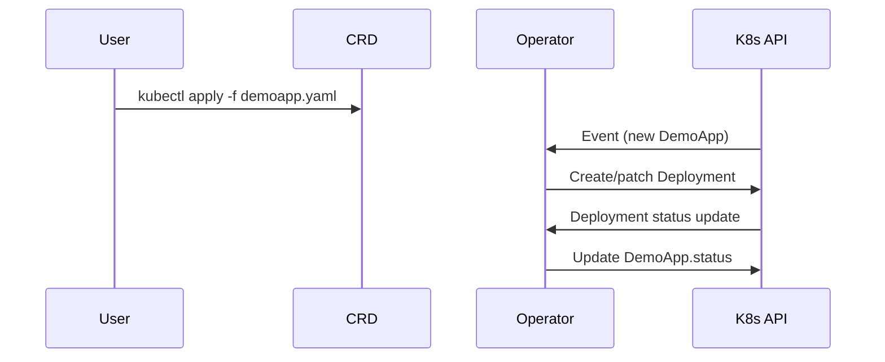

# Module 11: Operators & Custom Controllers

## Why it matters

A SaaS provider's platform team was overwhelmed by manual database failover and certificate renewal. Outages happened at 2am, and human error led to downtime. By building custom Kubernetes Operators, they automated these day-2 tasks, achieving self-healing and hands-off upgrades. This module shows how Operators and controllers can turn ops toil into code.

## Core concepts

- **Operator Pattern**: Extends Kubernetes with domain-specific automation using Custom Resource Definitions (CRDs) and controllers.
- **Controller-runtime**: The de facto library for writing controllers in Go, handling leader election, event filtering, and reconciliation loops.
- **Kubebuilder**: Scaffolding tool for rapidly building production-grade Operators.
- **Operator Lifecycle Manager (OLM)**: Manages installation, upgrades, and permissions for Operators in production clusters.
- **CRD Best Practices**: Versioning, validation, conversion webhooks, and status subresources.

## Hands-on lab

Let's scaffold and run a simple Operator that auto-heals a demo app:

```bash
# Prereqs: Go 1.22+, kubectl, kind, controller-gen, kustomize

# Create a kind cluster
kind create cluster --name operator-lab

# Install Operator Lifecycle Manager (OLM)
kubectl apply -f https://github.com/operator-framework/operator-lifecycle-manager/releases/download/v0.27.0/crds.yaml
kubectl apply -f https://github.com/operator-framework/operator-lifecycle-manager/releases/download/v0.27.0/olm.yaml

# Scaffold a new Operator with Kubebuilder
mkdir demo-operator && cd demo-operator
kubebuilder init --domain example.com --repo github.com/example/demo-operator
kubebuilder create api --group apps --version v1 --kind DemoApp

# Implement a simple reconcile loop (in controllers/demoapp_controller.go):
# - If DemoApp.spec.replicas != Deployment.spec.replicas, update Deployment
# - If DemoApp.spec.paused == true, scale to zero

# Generate manifests and CRDs
make manifests
make install

# Deploy the Operator
make run &  # or docker build/push and deploy via Deployment

# Create a DemoApp resource
cat <<EOF | kubectl apply -f -
apiVersion: apps.example.com/v1
kind: DemoApp
metadata:
  name: my-demo
spec:
  replicas: 2
  paused: false
EOF

# Watch the Operator create and manage a Deployment
kubectl get deployments
kubectl get demoapps

# Pause the app
kubectl patch demoapp my-demo --type=merge -p '{"spec":{"paused":true}}'

# Resume the app
kubectl patch demoapp my-demo --type=merge -p '{"spec":{"paused":false}}'

# Cloud note: OLM is available on OpenShift, EKS, AKS Marketplace
```

## Diagrams



## Gotchas & troubleshooting

- **Controller stuck?**
  - Check logs: `kubectl logs -l control-plane=controller-manager -n demo-operator-system`
  - Use `kubectl describe` on CRDs and Deployments for status and events
- **CRD validation errors**
  - Run `kubectl explain <crd>` and check OpenAPI schema
- **Leader election issues**
  - Only one controller pod should be leader; check pod logs for election messages
- **OLM install failures**
  - Ensure CRDs are installed before OLM components
- **Debugging**
  - Use `kubectl-debug` or ephemeral containers for live troubleshooting

## Further reading

- [Kubebuilder Book](https://book.kubebuilder.io/)
- [Operator SDK Docs](https://sdk.operatorframework.io/docs/)
- [Controller-runtime](https://pkg.go.dev/sigs.k8s.io/controller-runtime)
- [Operator Lifecycle Manager](https://olm.operatorframework.io/)
- [KEP-2140: CRD Validation & Conversion](https://github.com/kubernetes/enhancements/tree/master/keps/sig-api-machinery/2140-crd-validation-conversion) 