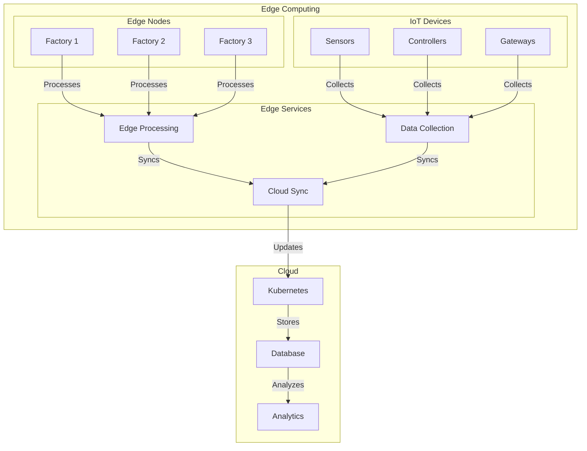

# Module 12: Edge Computing & IoT

## Why it matters

A manufacturing company deployed IoT sensors across 50+ factories but struggled with data processing latency and connectivity issues. By implementing Kubernetes at the edge with K3s and OpenYurt, they achieved local data processing, offline operation, and seamless cloud synchronization. This module explores running Kubernetes in resource-constrained environments and managing IoT workloads.

## Core concepts

Edge computing and IoT deployments require specialized approaches:

1. **Edge Kubernetes**:
   - K3s for lightweight clusters
   - OpenYurt for edge autonomy
   - KubeEdge for IoT
   - MicroK8s for edge devices

2. **Edge Patterns**:
   - Edge autonomy
   - Cloud-edge sync
   - Local processing
   - Offline operation

3. **IoT Integration**:
   - Device management
   - Data collection
   - Edge analytics
   - Cloud connectivity

## Hands-on lab

Let's set up an edge computing environment:

```bash
# Create edge cluster with K3s
curl -sfL https://get.k3s.io | sh -s - server \
  --disable traefik \
  --disable servicelb \
  --disable-cloud-controller \
  --write-kubeconfig-mode 644

# Install OpenYurt
helm repo add openyurt https://openyurtio.github.io/openyurt-helm
helm install yurt-manager openyurt/yurt-manager \
  --namespace kube-system \
  --set platform=openyurt

# Deploy edge application
cat <<EOF > edge-app.yaml
# Edge Node
apiVersion: v1
kind: Node
metadata:
  name: edge-node-1
  labels:
    openyurt.io/is-edge-worker: "true"
    topology.kubernetes.io/zone: factory-1
spec:
  taints:
  - key: node.kubernetes.io/not-ready
    effect: NoSchedule
---
# Edge Deployment
apiVersion: apps/v1
kind: Deployment
metadata:
  name: iot-processor
  namespace: edge-system
spec:
  replicas: 1
  selector:
    matchLabels:
      app: iot-processor
  template:
    metadata:
      labels:
        app: iot-processor
      annotations:
        openyurt.io/autonomy: "true"
    spec:
      nodeSelector:
        openyurt.io/is-edge-worker: "true"
      containers:
      - name: iot-processor
        image: ghcr.io/your-org/iot-processor:latest
        resources:
          requests:
            cpu: "100m"
            memory: "128Mi"
          limits:
            cpu: "200m"
            memory: "256Mi"
        volumeMounts:
        - name: iot-data
          mountPath: /data
        env:
        - name: EDGE_NODE
          valueFrom:
            fieldRef:
              fieldPath: spec.nodeName
        - name: OFFLINE_MODE
          value: "true"
      volumes:
      - name: iot-data
        hostPath:
          path: /var/lib/iot-data
---
# Edge Service
apiVersion: v1
kind: Service
metadata:
  name: iot-processor
  namespace: edge-system
  annotations:
    openyurt.io/autonomy: "true"
spec:
  selector:
    app: iot-processor
  ports:
  - port: 8080
    targetPort: 8080
  type: ClusterIP
---
# Device Management
apiVersion: devices.kubeedge.io/v1alpha2
kind: Device
metadata:
  name: temperature-sensor-1
  namespace: edge-system
spec:
  deviceModelRef:
    name: temperature-sensor-model
  nodeSelector:
    nodeSelectorTerms:
    - matchExpressions:
      - key: openyurt.io/is-edge-worker
        operator: In
        values:
        - "true"
---
# Data Collection
apiVersion: apps/v1
kind: DaemonSet
metadata:
  name: data-collector
  namespace: edge-system
spec:
  selector:
    matchLabels:
      app: data-collector
  template:
    metadata:
      labels:
        app: data-collector
    spec:
      nodeSelector:
        openyurt.io/is-edge-worker: "true"
      containers:
      - name: data-collector
        image: ghcr.io/your-org/data-collector:latest
        securityContext:
          privileged: true
        volumeMounts:
        - name: device-socket
          mountPath: /var/run/device.sock
      volumes:
      - name: device-socket
        hostPath:
          path: /var/run/device.sock
---
# Cloud Sync
apiVersion: apps.openyurt.io/v1alpha1
kind: UnitedDeployment
metadata:
  name: cloud-sync
  namespace: edge-system
spec:
  selector:
    matchLabels:
      app: cloud-sync
  workloadTemplate:
    deploymentTemplate:
      metadata:
        labels:
          app: cloud-sync
      spec:
        replicas: 1
        selector:
          matchLabels:
            app: cloud-sync
        template:
          metadata:
            labels:
              app: cloud-sync
          spec:
            containers:
            - name: cloud-sync
              image: ghcr.io/your-org/cloud-sync:latest
              env:
              - name: CLOUD_ENDPOINT
                value: "https://cloud.example.com"
  topology:
    pools:
    - name: factory-1
      nodeSelectorTerm:
        matchExpressions:
        - key: topology.kubernetes.io/zone
          operator: In
          values:
          - factory-1
      replicas: 1
EOF

kubectl apply -f edge-app.yaml

# Configure edge autonomy
cat <<EOF > edge-autonomy.yaml
apiVersion: apps.openyurt.io/v1alpha1
kind: NodePool
metadata:
  name: factory-1
spec:
  type: Edge
  selector:
    matchLabels:
      topology.kubernetes.io/zone: factory-1
---
apiVersion: apps.openyurt.io/v1alpha1
kind: YurtAppSet
metadata:
  name: edge-apps
spec:
  selector:
    matchLabels:
      app.kubernetes.io/part-of: edge-system
  workloadTemplate:
    deploymentTemplate:
      metadata:
        labels:
          app.kubernetes.io/part-of: edge-system
      spec:
        replicas: 1
        template:
          metadata:
            labels:
              app.kubernetes.io/part-of: edge-system
          spec:
            containers:
            - name: edge-app
              image: ghcr.io/your-org/edge-app:latest
  topology:
    pools:
    - name: factory-1
      nodeSelectorTerm:
        matchExpressions:
        - key: topology.kubernetes.io/zone
          operator: In
          values:
          - factory-1
      replicas: 1
EOF

kubectl apply -f edge-autonomy.yaml

# Monitor edge status
kubectl get nodes -l openyurt.io/is-edge-worker
kubectl get devices -n edge-system
kubectl get uniteddeployments -A
```

## Diagrams



## Gotchas & troubleshooting

1. **Edge Issues**
   ```bash
   # Check edge node status
   kubectl get nodes -l openyurt.io/is-edge-worker
   kubectl describe node edge-node-1
   
   # View edge logs
   kubectl logs -n kube-system -l app=yurt-manager
   kubectl logs -n edge-system -l app=iot-processor
   ```

2. **IoT Problems**
   ```bash
   # Check device status
   kubectl get devices -n edge-system
   kubectl describe device temperature-sensor-1
   
   # View data collector logs
   kubectl logs -n edge-system -l app=data-collector
   ```

3. **Common Failure Modes**
   - Edge node connectivity
   - Device communication
   - Cloud sync failures
   - Resource constraints
   - Network partitions

## Further reading

1. [K3s Documentation](https://k3s.io/)
2. [OpenYurt Documentation](https://openyurt.io/)
3. [KubeEdge Documentation](https://kubeedge.io/)
4. [KEP-1645: Edge Computing](https://github.com/kubernetes/enhancements/tree/master/keps/sig-node/1645-edge-computing)
5. [KEP-2294: IoT Device Management](https://github.com/kubernetes/enhancements/tree/master/keps/sig-node/2294-iot-device-management) 