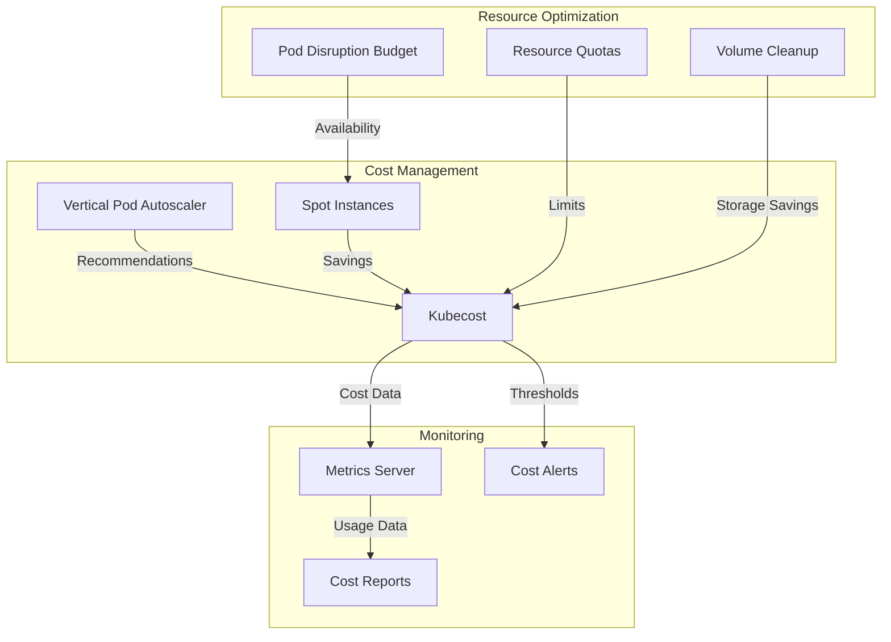

# Module 13: Cost & Performance

## Why it matters

A fintech startup's cloud bill skyrocketed to $100K/month after scaling their Kubernetes clusters. Investigation revealed idle nodes, oversized pods, and orphaned volumes. By implementing FinOps practices with Kubecost, right-sizing workloads, and using spot instances, they reduced costs by 60% while maintaining performance. This module explores cost optimization and performance tuning in Kubernetes.

## Core concepts

- **FinOps & Cost Management**: 
  - Resource allocation tracking
  - Cost attribution by namespace/team
  - Budget alerts and forecasting
  - Spot instance management
- **Performance Optimization**:
  - Right-sizing pods and nodes
  - Resource quotas and limits
  - Vertical Pod Autoscaling
  - Node pool optimization
- **Storage Cost Control**:
  - Volume lifecycle management
  - Storage class optimization
  - PV/PVC cleanup automation

## Hands-on lab

```bash
# Create a kind cluster with metrics support
cat <<EOF > kind-cost-config.yaml
kind: Cluster
apiVersion: kind.x-k8s.io/v1alpha4
nodes:
- role: control-plane
  extraPortMappings:
  - containerPort: 3000
    hostPort: 3000  # Kubecost UI
- role: worker
- role: worker
EOF

kind create cluster --config kind-cost-config.yaml --name cost-lab

# Install metrics-server for resource monitoring
kubectl apply -f https://github.com/kubernetes-sigs/metrics-server/releases/latest/download/components.yaml

# Install Kubecost for cost monitoring
helm repo add kubecost https://kubecost.github.io/cost-analyzer/
helm install kubecost kubecost/cost-analyzer \
  --namespace kubecost \
  --create-namespace \
  --set prometheus.server.persistentVolume.enabled=false

# Deploy VPA for pod right-sizing
kubectl apply -f https://raw.githubusercontent.com/kubernetes/autoscaler/master/vertical-pod-autoscaler/deploy/vpa-v1-crd.yaml
kubectl apply -f https://raw.githubusercontent.com/kubernetes/autoscaler/master/vertical-pod-autoscaler/deploy/vpa-rbac.yaml
kubectl apply -f https://raw.githubusercontent.com/kubernetes/autoscaler/master/vertical-pod-autoscaler/deploy/vpa-v1-deployment.yaml

# Create resource quotas
cat <<EOF | kubectl apply -f -
apiVersion: v1
kind: ResourceQuota
metadata:
  name: compute-resources
  namespace: default
spec:
  hard:
    requests.cpu: "4"
    requests.memory: 4Gi
    limits.cpu: "8"
    limits.memory: 8Gi
    persistentvolumeclaims: "10"
---
# Pod Disruption Budget for spot instances
apiVersion: policy/v1
kind: PodDisruptionBudget
metadata:
  name: app-pdb
spec:
  minAvailable: 2
  selector:
    matchLabels:
      app: sample-app
EOF

# Deploy a sample application with VPA
cat <<EOF | kubectl apply -f -
apiVersion: autoscaling.k8s.io/v1
kind: VerticalPodAutoscaler
metadata:
  name: sample-app-vpa
spec:
  targetRef:
    apiVersion: "apps/v1"
    kind: Deployment
    name: sample-app
  updatePolicy:
    updateMode: "Auto"
---
apiVersion: apps/v1
kind: Deployment
metadata:
  name: sample-app
spec:
  replicas: 3
  selector:
    matchLabels:
      app: sample-app
  template:
    metadata:
      labels:
        app: sample-app
    spec:
      containers:
      - name: app
        image: nginx:latest
        resources:
          requests:
            cpu: 100m
            memory: 128Mi
          limits:
            cpu: 200m
            memory: 256Mi
EOF

# Install volume cleanup operator
helm repo add kubecost https://kubecost.github.io/cost-analyzer/
helm install volume-cleanup kubecost/kubecost-cost-analyzer \
  --namespace kubecost \
  --set volumeCleanup.enabled=true

# Create spot instance node pool (EKS example)
cat <<EOF > spot-nodepool.yaml
apiVersion: eksctl.io/v1alpha5
kind: ClusterConfig
metadata:
  name: cost-optimized
  region: us-west-2
managedNodeGroups:
- name: spot-nodes
  instanceTypes: ["t3.medium", "t3a.medium"]
  spot: true
  minSize: 1
  maxSize: 5
  desiredCapacity: 2
  labels:
    node.kubernetes.io/instance-type: spot
  taints:
  - key: spotInstance
    value: "true"
    effect: PreferNoSchedule
EOF

# Monitor costs and performance
kubectl port-forward -n kubecost svc/kubecost-cost-analyzer 3000:9090
# Access Kubecost UI at http://localhost:3000

# Check VPA recommendations
kubectl describe vpa sample-app-vpa

# Monitor resource usage
kubectl top pods
kubectl top nodes

# Cloud note: For EKS/AKS/GKE, enable spot instances and use node auto-provisioning
```

## Diagrams



## Gotchas & troubleshooting

- **Cost Spikes**
  ```bash
  # Check resource usage
  kubectl top pods --sort-by=cpu
  kubectl top nodes --sort-by=memory
  
  # Investigate VPA recommendations
  kubectl describe vpa
  
  # Check for orphaned volumes
  kubectl get pvc --all-namespaces
  kubectl get pv
  ```

- **Performance Issues**
  ```bash
  # Check resource quotas
  kubectl describe resourcequota
  
  # Monitor pod disruption budgets
  kubectl get pdb
  
  # Check node pressure
  kubectl describe nodes | grep -A 5 "Pressure"
  ```

- **Common Failure Modes**
  - Spot instance terminations
  - Resource quota exhaustion
  - VPA update conflicts
  - Storage cost spikes
  - Node pool scaling issues

## Further reading

1. [Kubecost Documentation](https://docs.kubecost.com/)
2. [Kubernetes Resource Management](https://kubernetes.io/docs/concepts/configuration/manage-resources-containers/)
3. [VPA Best Practices](https://github.com/kubernetes/autoscaler/tree/master/vertical-pod-autoscaler)
4. [KEP-2657: Resource Management](https://github.com/kubernetes/enhancements/tree/master/keps/sig-node/2657-resource-management)
5. [FinOps Foundation](https://www.finops.org/) 