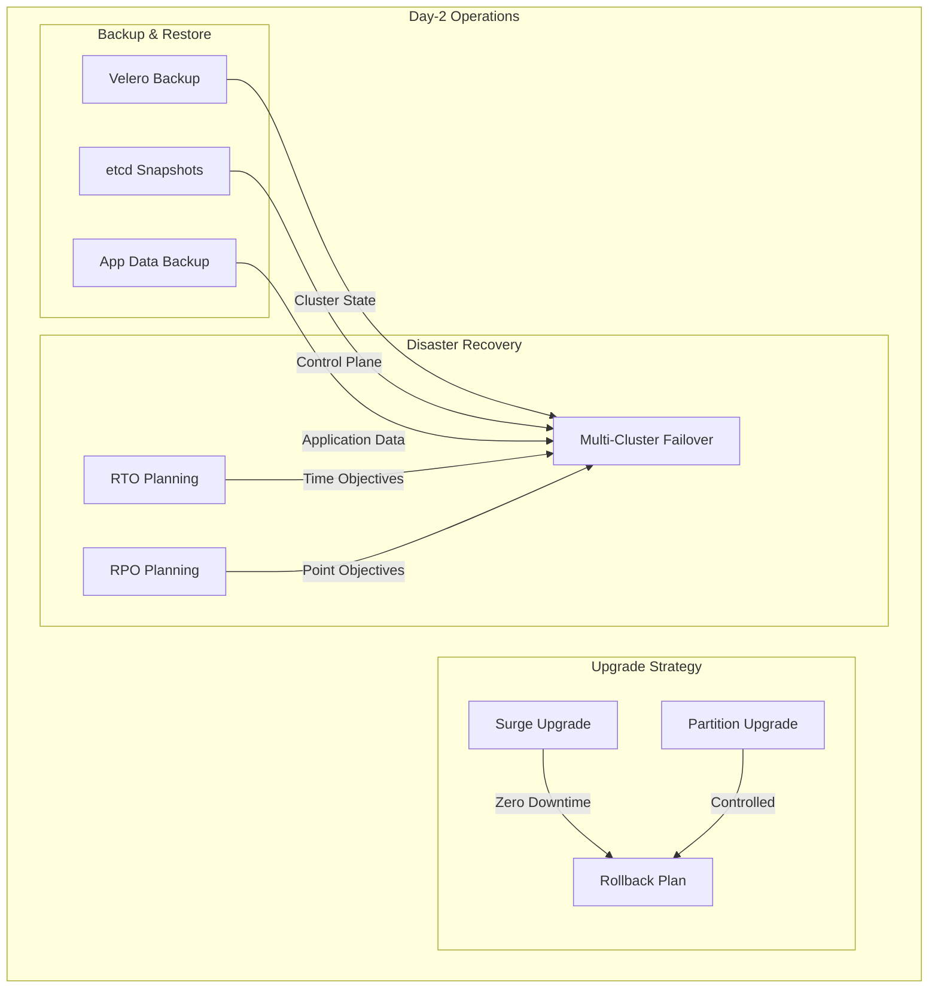

# Module 14: Day-2 Operations

## Why it matters

A healthcare platform's Kubernetes upgrade failed at 3 AM, causing a 4-hour outage. The team had no backup strategy, and manual recovery took hours. By implementing zero-downtime upgrades, automated backups with Velero, and regular disaster recovery drills, they now maintain 99.99% uptime. This module covers essential day-2 operations for production-grade Kubernetes.

## Core concepts

- **Zero-Downtime Upgrades**:
  - Surge vs. partition strategies
  - Version compatibility
  - Rollback procedures
  - Pre-upgrade validation
- **Backup & Restore**:
  - Velero for cluster backup
  - etcd snapshots
  - Application data backup
  - Cross-cluster recovery
- **Disaster Recovery**:
  - Recovery time objectives
  - Recovery point objectives
  - Multi-cluster failover
  - DR testing automation

## Hands-on lab

```bash
# Create a kind cluster for DR testing
kind create cluster --name dr-lab

# Install Velero for backup/restore
velero install \
  --provider aws \
  --plugins velero/velero-plugin-for-aws:v1.5.0 \
  --bucket k8s-backups \
  --backup-location-config region=us-west-2 \
  --secret-file ./credentials-velero

# Configure backup schedule
cat <<EOF | kubectl apply -f -
apiVersion: velero.io/v1
kind: Schedule
metadata:
  name: daily-backup
  namespace: velero
spec:
  schedule: "0 1 * * *"  # Daily at 1 AM
  template:
    includedNamespaces:
    - default
    - kube-system
    storageLocation: default
    volumeSnapshotLocations:
    - default
    ttl: 720h  # 30 days
EOF

# Create etcd backup script
cat <<'EOF' > backup-etcd.sh
#!/bin/bash
ETCD_POD=$(kubectl get pods -n kube-system -l component=etcd -o jsonpath='{.items[0].metadata.name}')
kubectl exec -n kube-system $ETCD_POD -- etcdctl snapshot save /var/lib/etcd/snapshot.db
kubectl cp kube-system/$ETCD_POD:/var/lib/etcd/snapshot.db ./etcd-snapshot-$(date +%Y%m%d).db
EOF
chmod +x backup-etcd.sh

# Configure zero-downtime upgrade strategy
cat <<EOF | kubectl apply -f -
apiVersion: apps/v1
kind: Deployment
metadata:
  name: critical-app
spec:
  replicas: 3
  strategy:
    type: RollingUpdate
    rollingUpdate:
      maxSurge: 1
      maxUnavailable: 0
  selector:
    matchLabels:
      app: critical-app
  template:
    metadata:
      labels:
        app: critical-app
    spec:
      containers:
      - name: app
        image: nginx:1.24
        readinessProbe:
          httpGet:
            path: /health
            port: 80
          initialDelaySeconds: 5
          periodSeconds: 10
        livenessProbe:
          httpGet:
            path: /health
            port: 80
          initialDelaySeconds: 15
          periodSeconds: 20
---
# Pod Disruption Budget for zero-downtime
apiVersion: policy/v1
kind: PodDisruptionBudget
metadata:
  name: critical-app-pdb
spec:
  minAvailable: 2
  selector:
    matchLabels:
      app: critical-app
EOF

# Create DR test script
cat <<'EOF' > test-dr.sh
#!/bin/bash
# Simulate cluster failure
kubectl drain --ignore-daemonsets --delete-emptydir-data --force $(kubectl get nodes -o name)

# Restore from Velero backup
velero restore create --from-backup daily-backup

# Verify application health
kubectl rollout status deployment/critical-app
kubectl get pods -l app=critical-app

# Check etcd health
kubectl get componentstatuses
EOF
chmod +x test-dr.sh

# Configure monitoring for upgrade safety
cat <<EOF | kubectl apply -f -
apiVersion: monitoring.coreos.com/v1
kind: PrometheusRule
metadata:
  name: upgrade-safety
  namespace: monitoring
spec:
  groups:
  - name: upgrade.rules
    rules:
    - alert: UpgradeSafetyCheck
      expr: |
        max(kube_deployment_status_replicas_available{namespace="default"}) 
        < 
        max(kube_deployment_spec_replicas{namespace="default"})
      for: 5m
      labels:
        severity: critical
      annotations:
        summary: "Deployment replicas mismatch during upgrade"
---
apiVersion: batch/v1
kind: CronJob
metadata:
  name: pre-upgrade-check
spec:
  schedule: "0 0 * * *"  # Daily
  jobTemplate:
    spec:
      template:
        spec:
          containers:
          - name: check
            image: bitnami/kubectl
            command:
            - /bin/sh
            - -c
            - |
              kubectl get nodes
              kubectl get pods --all-namespaces
              kubectl get pvc --all-namespaces
              kubectl get pv
          restartPolicy: OnFailure
EOF

# Cloud note: For EKS/AKS/GKE, use managed upgrade features
# Example EKS upgrade:
eksctl upgrade cluster --name=dr-lab --region=us-west-2 --approve
```

## Diagrams



## Gotchas & troubleshooting

- **Upgrade Issues**
  ```bash
  # Check upgrade status
  kubectl get nodes
  kubectl get pods --all-namespaces
  
  # Verify etcd health
  kubectl get componentstatuses
  kubectl logs -n kube-system -l component=etcd
  
  # Check for upgrade blockers
  kubectl get events --sort-by='.lastTimestamp'
  ```

- **Backup Problems**
  ```bash
  # Check Velero status
  velero backup get
  velero restore get
  
  # Verify etcd backup
  kubectl exec -n kube-system $ETCD_POD -- etcdctl snapshot status /var/lib/etcd/snapshot.db
  
  # Test restore
  velero restore create --from-backup daily-backup --wait
  ```

- **Common Failure Modes**
  - Upgrade timeouts
  - Backup failures
  - Restore conflicts
  - Network partitioning
  - Resource exhaustion

## Further reading

1. [Velero Documentation](https://velero.io/docs/)
2. [Kubernetes Upgrade Guide](https://kubernetes.io/docs/tasks/administer-cluster/kubeadm/kubeadm-upgrade/)
3. [etcd Disaster Recovery](https://etcd.io/docs/v3.5/op-guide/recovery/)
4. [KEP-2579: Cluster Upgrade](https://github.com/kubernetes/enhancements/tree/master/keps/sig-cluster-lifecycle/2579-cluster-upgrade)
5. [Disaster Recovery Best Practices](https://kubernetes.io/docs/tasks/administer-cluster/configure-upgrade-etcd/) 