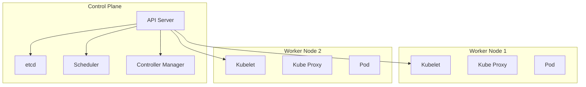

# Module 01: Introduction & Architecture

## Learning Objectives
By the end of this module, you will be able to:
- Explain what Kubernetes is and why we use it.
- Understand the difference between Containers and VMs.
- Describe the high-level architecture of a Kubernetes cluster (Control Plane vs. Worker Nodes).

## 1. The Evolution of App Deployment

To understand why we need Kubernetes, we first need to understand **Containers**, and to understand Containers, we need to look at history.

### 1.1 Traditional Deployment (The Dark Ages)
In the past, we ran applications on physical servers.
- **Problem**: If you had 3 apps, you often needed 3 physical servers to prevent them from interfering with each other.
- **Result**: Huge waste of resources (servers sitting at 10% CPU) and slow deployment times.

### 1.2 Virtualized Deployment (The VM Era)
Virtualization allowed us to run multiple Virtual Machines (VMs) on a single physical server's CPU.
- **Solution**: Better resource utilization. Each VM is a full computer with its own OS.
- **New Problem**: VMs are heavy. Each one needs a full OS (GBs of size), takes minutes to boot, and patching them is a nightmare.

### 1.3 Container Deployment (The Modern Era)
Containers solve the "heavy" problem of VMs.
- **Solution**: Instead of virtualizing the hardware, we **virtualize the Operating System**.
- **Result**: Containers are lightweight (MBs), start instantly, and are portable.

**Analogy**:
- **Traditional**: A separate house for every person. (Expensive, wasteful).
- **VMs**: An apartment building, but every apartment has its own plumbing, heating, and power plant. (Heavy, complex).
- **Containers**: A hotel. Everyone shares the same infrastructure (plumbing/power), but has their own private room. (Efficient, lightweight).

## 2. What is Kubernetes?

Kubernetes (often abbreviated as **K8s**) is an open-source platform for automating the deployment, scaling, and management of containerized applications.

Think of it as an **orchestrator** for your containers. If a container is like a musician playing an instrument, Kubernetes is the conductor ensuring everyone plays in sync, comes in at the right time, and that the show goes on even if someone gets sick.

### Why do we need it?
- **Self-healing**: Restarts containers that fail, replaces and reschedules containers when nodes die.
- **Scaling**: Automatically scales your application up and down based on usage.
- **Load Balancing**: Distributes network traffic so that the deployment is stable.

## 3. Containers vs. Virtual Machines (VMs)

| Feature | Virtual Machines (VMs) | Containers |
| :--- | :--- | :--- |
| **Isolation** | Hardware-level virtualization (Hypervisor) | OS-level virtualization (Shared Kernel) |
| **Weight** | Heavy (Includes full OS) | Lightweight (KB/MBs) |
| **Startup Time** | Minutes | Milliseconds/Seconds |
| **Portability** | Lower (Dependent on Hypervisor) | High (Run anywhere with a container runtime) |

## 4. High-Level Architecture

A Kubernetes cluster consists of two main types of servers (nodes):

### 4.1 The Control Plane (The Brain)
The Control Plane manages the cluster and makes global decisions (like scheduling).

- **API Server (`kube-apiserver`)**: The front door. All communication (kubectl, UI, other components) goes through here.
- **etcd**: The memory. A consistent and highly-available key value store for all cluster data.
- **Scheduler (`kube-scheduler`)**: The planner. Decides which node a new Pod should run on.
- **Controller Manager (`kube-controller-manager`)**: The regulator. Checks the state of the cluster and tries to move it towards the desired state.

### 4.2 Worker Nodes (The Muscle)
These are the machines where your applications (containers) actually run.

- **Kubelet**: The agent. Runs on every node and ensures containers are running in a Pod.
- **Kube Proxy**: The networker. Maintains network rules on nodes to allow network communication to your Pods.
- **Container Runtime**: The software that runs containers (e.g., containerd, CRI-O, Docker Engine).

## Diagram

## Summary
- **Kubernetes** orchestrates containers.
- **Containers** are lightweight and share the OS kernel.
- **Control Plane** manages the cluster.
- **Worker Nodes** run the applications.

[Next: Module 02 - First Steps](02-first-steps.md)
